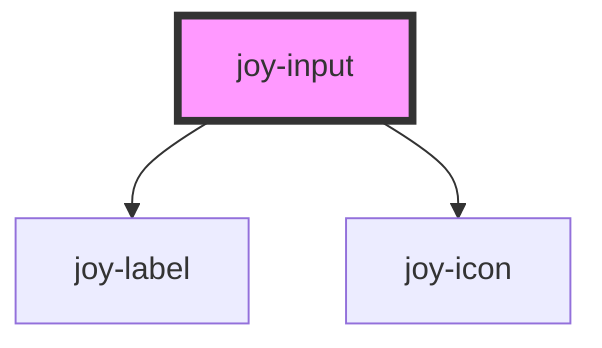

```ui_example
<joy-input value="I am a value" name="my-stencil-input">
    My input label
</joy-input>
```

## Types

```ui_example
<joy-input value="I am a value" name="my-stencil-input">My basic input</joy-input>

<joy-input icon="location" value="New York" name="my-location-input">My basic input with icon</joy-input>

<joy-input type="number" unit="%" value="300" name="my-location-input">My unit input</joy-input>

<joy-input type="password" value="12345" name="my-location-input">My password input</joy-input>
```


## Sizes 
Unit is for testing purpose. Remove it if you don't need it.

```ui_example
<joy-input size="small" unit="€" icon="search" value="I am a value" name="my-stencil-input">My small input</joy-input>
<joy-input size="medium" unit="€" icon="search" value="I am a value" name="my-stencil-input">My medium input</joy-input>
<joy-input size="large" unit="days/month" icon="search" value="I am a value" name="my-stencil-input">My large input</joy-input>
```

## States
```ui_example
<joy-input  icon="location" value="I am a value" name="my-stencil-input">My basic input</joy-input>

<joy-input  icon="location" value="Can't write in this field" disabled name="my-disabled-input">My disabled input</joy-input>

<joy-input icon="location" required placeholder="Placeholder" name="my-invalid-input">My invalid input</joy-input>
```


## CSS Fallback
For any reason, if you can't use webcomponent version, use this plain HTML/CSS (degraded!) fallback. No JavaScript.

```ui_example
<div class="joy-input joy-input--medium">
    <joy-label id="fallback-id">CSS fallback input</joy-label>
    <div class="joy-input--wrapper joy-input--wrapper-has-icon">
        <input type="text" placeholder="My placeholder" aria-labelledby="fallback-id" name="my-fallback-input" />
        <joy-icon name="location" class="joy-input--decorative-icon"></joy-icon>
    </div>
</div> 

<div class="joy-input joy-input--medium">
    <joy-label id="fallback-id-2">CSS fallback input</joy-label>
    <div class="joy-input--wrapper joy-input--wrapper-has-icon">
        <input type="text" placeholder="My placeholder" disabled aria-labelledby="fallback-id-2" name="my-fallback-input" />
        <joy-icon name="location" class="joy-input--decorative-icon"></joy-icon>
    </div>
</div> 

<div class="joy-input joy-input--medium joy-input--invalid">
    <joy-label id="fallback-id-3">CSS fallback input</joy-label>
    <div class="joy-input--wrapper joy-input--wrapper-has-icon">
        <input type="text" aria-invalid="true" required placeholder="My placeholder" aria-labelledby="fallback-id-3" name="my-fallback-input" />
        <joy-icon name="location" class="joy-input--decorative-icon"></joy-icon>
    </div>
</div> 

<div class="joy-input joy-input--medium">
    <joy-label id="fallback-id">CSS fallback input</joy-label>
    <div class="joy-input--wrapper joy-input--wrapper-unit">
        <input type="number" placeholder="My placeholder" aria-labelledby="fallback-id-4" name="my-fallback-input" />
        <div class="joy-input--unit" data-unit="day/month"></div>
    </div>
</div> 
```


<!-- Auto Generated Below -->


## Properties

| Property       | Attribute      | Description                                                                                              | Type                                                                           | Default     |
| -------------- | -------------- | -------------------------------------------------------------------------------------------------------- | ------------------------------------------------------------------------------ | ----------- |
| `autocomplete` | `autocomplete` | The input's autocomplete policy.                                                                         | `string`                                                                       | `'off'`     |
| `disabled`     | `disabled`     | Makes the field disabled or not                                                                          | `boolean`                                                                      | `false`     |
| `icon`         | `icon`         | Add an icon on the left side before the value                                                            | `string / undefined`                                                          | `undefined` |
| `invalid`      | `invalid`      | Makes the field readonly or not                                                                          | `boolean`                                                                      | `false`     |
| `max`          | `max`          | If the type is "number" then you can use max property.                                                   | `number / undefined`                                                          | `undefined` |
| `min`          | `min`          | If the type is "number" then you can use min property.                                                   | `number / undefined`                                                          | `undefined` |
| `name`         | `name`         | Input types. List is not exhaustive, this component does not deal with checkboxes, radios, files, dates. | `string`                                                                       | `''`        |
| `placeholder`  | `placeholder`  | The input's placeholder text.                                                                            | `string`                                                                       | `''`        |
| `readonly`     | `readonly`     | Makes the field readonly or not                                                                          | `boolean`                                                                      | `false`     |
| `required`     | `required`     | Makes the field required                                                                                 | `boolean`                                                                      | `false`     |
| `size`         | `size`         | The input's size.                                                                                        | `"large" / "medium" / "small"`                                               | `'medium'`  |
| `type`         | `type`         | Input types. List is not exhaustive, this component does not deal with checkboxes, radios, files, dates. | `"email" / "hidden" / "number" / "password" / "search" / "tel" / "text"` | `'text'`    |
| `unit`         | `unit`         | If the field is of type number, you can specify a unit like %, days, hours, whatever you want            | `string / undefined`                                                          | `undefined` |
| `value`        | `value`        | Field value                                                                                              | `string`                                                                       | `''`        |


## Events

| Event         | Description                                                                                           | Type                                                                          |
| ------------- | ----------------------------------------------------------------------------------------------------- | ----------------------------------------------------------------------------- |
| `valueChange` | Custom event that returns the component instance and its actual value. Binded to input native event * | `CustomEvent<{ element: HTMLJoyInputElement; value?: string / undefined; }>` |


## Methods

### `setFocus() => Promise<void>`

At the moment, for E2E purpose

#### Returns

Type: `Promise<void>`


## Dependencies

### Depends on

- [joy-label](../label)
- [joy-icon](../icon)

### Graph


----------------------------------------------

*Built with [StencilJS](https://stenciljs.com/)*
