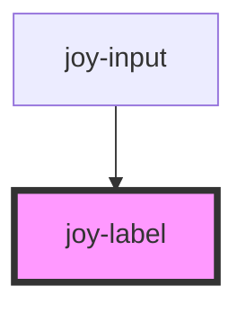

# joy-label

<!-- Auto Generated Below -->

## Properties

| Property | Attribute | Description  | Type                  | Default    |
| -------- | --------- | ------------ | --------------------- | ---------- |
| `size`   | `size`    | Label size * | `"large" / "medium"` | `'medium'` |

## Dependencies

### Used by

 - [joy-input](../input)

### Graph

----------------------------------------------

*Built with [StencilJS](https://stenciljs.com/)*
