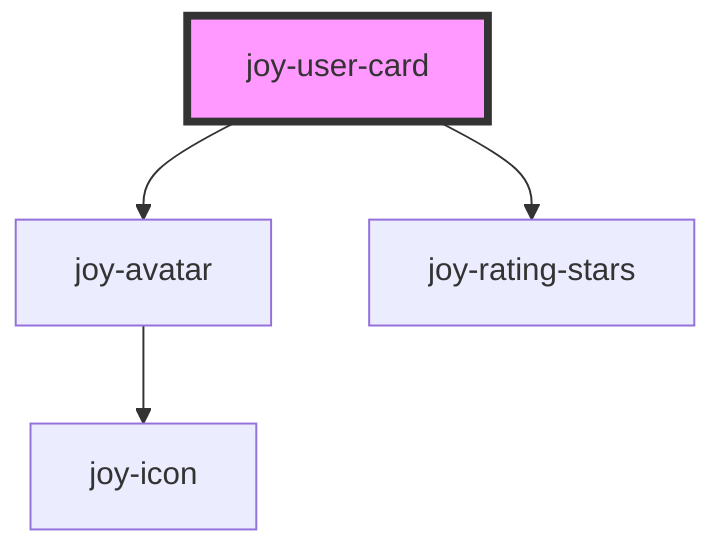

## Shorter example
If you don't want to deal with any slot, please use following example :

```ui_example
<joy-user-card 
        link="https://malt.fr"
        new-tab="true"
        rating-value="4"
        full-name="Tom Hanks" 
        sub-title="I don't work for FedEx"
        photo-url="https://globalnews.ca/wp-content/uploads/2018/08/gettyimages-903462776.jpg?w=2048">
</joy-user-card>
```

## With slot

```ui_example
<joy-user-card full-name="Tom Hanks" sub-title="I don't work for FedEx">
    <joy-avatar slot="user-card-avatar" photo-url="https://globalnews.ca/wp-content/uploads/2018/08/gettyimages-903462776.jpg?w=2048"></joy-avatar>
</joy-user-card>
```

### With rating stars

```ui_example
<joy-user-card full-name="Tom Hanks" sub-title="I don't work for FedEx" rating-value="4.5">
    <joy-avatar slot="user-card-avatar" photo-url="https://globalnews.ca/wp-content/uploads/2018/08/gettyimages-903462776.jpg?w=2048"></joy-avatar>
</joy-user-card>
```

### Link to

```ui_example
<joy-user-card link="https://malt.fr" new-tab="true" full-name="Tom Hanks" sub-title="I don't work for FedEx" rating-value="4.5">
    <joy-avatar slot="user-card-avatar" photo-url="https://globalnews.ca/wp-content/uploads/2018/08/gettyimages-903462776.jpg?w=2048"></joy-avatar>
</joy-user-card>
```

### Slots examples

```ui_example
<joy-user-card full-name="Tom Hanks" sub-title="I don't work for FedEx" rating-value="4.5">
    <joy-avatar slot="user-card-avatar" photo-url="https://globalnews.ca/wp-content/uploads/2018/08/gettyimages-903462776.jpg?w=2048"></joy-avatar>
    <span slot="user-card-title">I am a title rendered with slot</span>
    <span slot="user-card-subtitle">I am a subtitle rendered with slot</span>
    <joy-rating-stars slot="user-card-rating-stars" rating-value="2">
        <span slot="rating-stars-slot">(5 missions)</span>
    </joy-rating-stars>
</joy-user-card>
```

### Free slots examples

```ui_example
<joy-user-card full-name="Tom Hanks" sub-title="I don't work for FedEx" photo-url="https://globalnews.ca/wp-content/uploads/2018/08/gettyimages-903462776.jpg?w=2048">
    <a href="#" slot="user-card-free-slot"> I am a slotted link</a>
    <p slot="user-card-free-slot">Free slot</p>
    <strong slot="user-card-free-slot">Strong content slot</strong>
    <small slot="user-card-free-slot">Small text in slot</small>
    <joy-badge-level slot="user-card-free-slot" type="highpotential"></joy-badge-level>
</joy-user-card>
```

<!-- Auto Generated Below -->


## Properties

| Property      | Attribute      | Description                                                                                                            | Type                   | Default     |
| ------------- | -------------- | ---------------------------------------------------------------------------------------------------------------------- | ---------------------- | ----------- |
| `fullName`    | `full-name`    | Can be the freelancer's full name, or whatever you want. It will be placed at the top right part.                      | `string / undefined`  | `undefined` |
| `link`        | `link`         | Giving a link will make the whole component wrapped by an hyperlink                                                    | `string / undefined`  | `undefined` |
| `newTab`      | `new-tab`      | Given the link, it will open the link in a new tab                                                                     | `boolean / undefined` | `false`     |
| `photoUrl`    | `photo-url`    | Use this prop if you don't want to use the user-card-avatar slot.                                                      | `string / undefined`  | `undefined` |
| `ratingValue` | `rating-value` | Freelancer's public rating.                                                                                            | `string / undefined`  | `undefined` |
| `subTitle`    | `sub-title`    | Can be the freelancer's job, a company name or whatever you want. It will be placed at the top right part, below title | `string / undefined`  | `undefined` |


## Slots

| Slot                       | Description                                                                                                                                                                                                      |
| -------------------------- | ---------------------------------------------------------------------------------------------------------------------------------------------------------------------------------------------------------------- |
| `"user-card-avatar"`       | Inject a joy-avatar component here, with the photo URL or the full name if no photo available.                                                                                                                   |
| `"user-card-free-slot"`    | Hope you won't need to use it, but in case you need to fully customize the right part of the component, use this slot and inject the HTML you need. Deal with your own CSS, don't add it in the core component ! |
| `"user-card-rating-stars"` | Render your rating stars element if you need its slot access.                                                                                                                                                    |
| `"user-card-subtitle"`     | Main subtitle of the user card. Basically the freelancer's job, but you can actually pass any content if you need to customize. Prefer using subTitle prop instead.                                              |
| `"user-card-title"`        | Main title of the user card. Basically the freelancer's full name, but you can actually pass a company name or whatever you want if you need to customize. Prefer using fullName prop instead.                   |


## Dependencies

### Depends on

- [joy-avatar](../avatar)
- [joy-rating-stars](../rating-stars)

### Graph


----------------------------------------------

*Built with [StencilJS](https://stenciljs.com/)*
