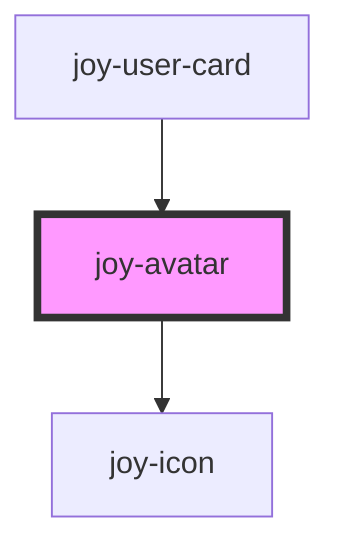

<joy-highlight level="warning">If you have multiple avatars to display in a list, use <a href="#joy-avatars-list">joy-avatars-list</a></joy-highlight>

##Sizes

```ui_example
<joy-avatar size="large" photo-url="https://globalnews.ca/wp-content/uploads/2018/08/gettyimages-903462776.jpg?w=2048"></joy-avatar>
<joy-avatar size="medium" photo-url="https://globalnews.ca/wp-content/uploads/2018/08/gettyimages-903462776.jpg?w=2048"></joy-avatar>
<joy-avatar size="small" photo-url="https://globalnews.ca/wp-content/uploads/2018/08/gettyimages-903462776.jpg?w=2048"></joy-avatar>
```

## No photo ?

```ui_example
<joy-avatar color="teal" size="large" full-name="Tom Hanks"></joy-avatar>
<joy-avatar color="red" size="medium" full-name="Tom Hanks"></joy-avatar>
<joy-avatar color="yellow" size="small" full-name="Tom Hanks"></joy-avatar>
```

## No name, no photo ?

```ui_example
<joy-avatar size="large"></joy-avatar>
<joy-avatar size="medium"></joy-avatar>
<joy-avatar size="small"></joy-avatar>
```

## More avatars to display ?

With or without link 

```ui_example
<joy-avatar total-number="15"></joy-avatar>
<joy-avatar total-number="15" total-number-link="https://malt.fr"></joy-avatar>
```

<!-- Auto Generated Below -->


## Properties

| Property          | Attribute            | Description                                                                                                                                                    | Type                                                                                 | Default     |
| ----------------- | -------------------- | -------------------------------------------------------------------------------------------------------------------------------------------------------------- | ------------------------------------------------------------------------------------ | ----------- |
| `color`           | `color`              | Specify a background color. Handy for avatars list. The value is the index of css custom property array made from CSS Custom Properties value (see next table) | `"grey" \| "red" \| "teal" \| "transparent" \| "turquoise" \| "yellow" \| undefined` | `'teal'`    |
| `compress`        | `compress`           | The prop is given automatically by avatars-list component when you set compress prop to true. You won't need this prop out of an avatars-list.                 | `boolean`                                                                            | `false`     |
| `fullName`        | `full-name`          | Freelancer full name. Will be used to display its initials if no photoUrl is given.                                                                            | `string \| undefined`                                                                | `undefined` |
| `href`            | `href`               | Url you need to link your avatar to                                                                                                                            | `string \| undefined`                                                                | `undefined` |
| `isFirstFromList` | `is-first-from-list` | The prop is given automatically by avatars-list component when you set compress prop to true. You won't need this prop out of an avatars-list.                 | `boolean`                                                                            | `false`     |
| `photoUrl`        | `photo-url`          | Specify a photo url to display.                                                                                                                                | `string \| undefined`                                                                | `undefined` |
| `size`            | `size`               | Avatar size, 3 possible values (can't be overridden)                                                                                                           | `"large" \| "medium" \| "small" \| undefined`                                        | `'medium'`  |
| `target`          | `target`             | Target attribute if href is used                                                                                                                               | `"_blank" \| "_parent" \| "_self" \| "_top" \| "framename" \| undefined`             | `undefined` |
| `totalNumber`     | `total-number`       | Specify the total amount of persons remaining from a list.                                                                                                     | `number \| undefined`                                                                | `undefined` |
| `totalNumberLink` | `total-number-link`  | Specify the link to redirect to the full list                                                                                                                  | `string \| undefined`                                                                | `undefined` |


## Dependencies

### Used by

 - [joy-user-card](../user-card)

### Depends on

- [joy-icon](../icon)

### Graph


----------------------------------------------

*Built with [StencilJS](https://stenciljs.com/)*
