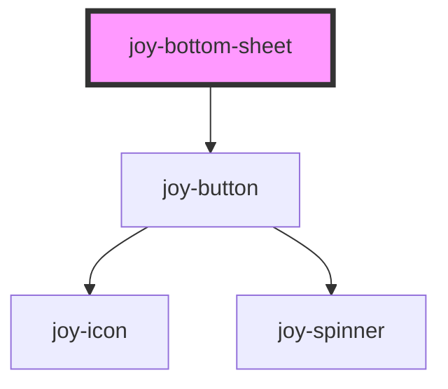

<joy-link target="_blank" href="https://joy.malt.com/6bf479565/p/90c963--bottom-sheet">
    <joy-icon name="web-design"></joy-icon>&nbsp;See Zeroheight usage
</joy-link>

<joy-tag variant='special'>EXPERIMENTAL</joy-tag>

## Default -> Primary

```ui_example
<joy-bottom-sheet>
    <div slot='bottom-sheet-content'>Content</div>
</joy-bottom-sheet> 
```

## Secondary

See [joy-button](../button) documentation

```ui_example
<joy-bottom-sheet close-variant="secondary" close-label="OK">
    <div slot='bottom-sheet-content'>Content</div>
</joy-bottom-sheet> 
```


<!-- Auto Generated Below -->


## Properties

| Property       | Attribute       | Description                                                                           | Type                                                                  | Default     |
| -------------- | --------------- | ------------------------------------------------------------------------------------- | --------------------------------------------------------------------- | ----------- |
| `closeLabel`   | `close-label`   | close-label used for close button. Default: 'Close'                                   | `string`                                                              | `'Close'`   |
| `closeVariant` | `close-variant` | close-variant used for close button. Default: 'primary' See: joy-button documentation | `"admin" \| "ghost" \| "main" \| "primary" \| "secondary" \| "white"` | `'primary'` |


## Methods

### `close() => Promise<void>`

Call this method to close the bottom sheet.
Example: el.close()

#### Returns

Type: `Promise<void>`


### `open() => Promise<void>`

Call this method to open the bottom sheet.
Example: el.open()

#### Returns

Type: `Promise<void>`


## Dependencies

### Depends on

- [joy-button](../button)

### Graph


----------------------------------------------

*Built with [StencilJS](https://stenciljs.com/)*
