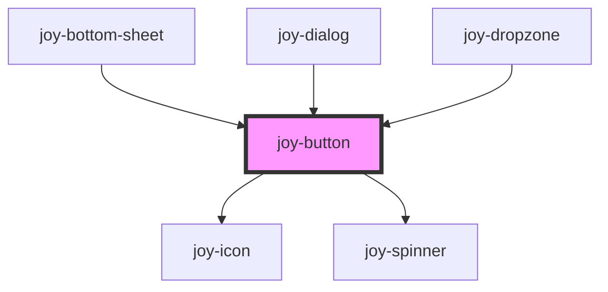

## Main

```ui_example
<joy-button variant="main">Main button</joy-button>
<joy-button variant="main" icon="heart">Main button</joy-button>
<joy-button variant="main" icon="heart" disabled>Main button</joy-button>
```

## Primary

```ui_example
<joy-button variant="primary">Primary button</joy-button>
<joy-button variant="primary" icon="heart">Primary button</joy-button>
<joy-button variant="primary" icon="heart" disabled>Primary button</joy-button>
```

## Secondary 
```ui_example
<joy-button variant="secondary">Secondary button</joy-button>
<joy-button variant="secondary" icon="heart">Secondary button</joy-button>
<joy-button variant="secondary" icon="heart" disabled>Secondary button</joy-button>
```

## White

<div style="background-color: #737370; padding: 20px;">
<joy-button variant="white">White button</joy-button>
<joy-button variant="white" icon="heart">White button</joy-button>
<joy-button variant="white" icon="heart" disabled>White button</joy-button>
</div>

```ui_code_example
<joy-button variant="white">White button</joy-button>
<joy-button variant="white" icon="heart">White button</joy-button>
<joy-button variant="white" icon="heart" disabled>White button</joy-button>
```

## Ghost
<div style="background-color: #E0DED9; padding: 20px;">
    <joy-button variant="ghost">Ghost button</joy-button>
    <joy-button variant="ghost" icon="heart">Ghost button</joy-button>
    <joy-button variant="ghost" icon="heart" disabled>Ghost button</joy-button>
</div>

```ui_code_example
<joy-button variant="ghost">Ghost button</joy-button>
<joy-button variant="ghost" icon="heart">Ghost button</joy-button>
<joy-button variant="ghost" icon="heart" disabled>Ghost button</joy-button>
```

## Bonus
```ui_example
<joy-button type="button" variant="admin">Admin button</joy-button>
```

## Sizes 

```ui_example
<joy-button variant="main" size="xsmall">Xsmall button</joy-button>
<joy-button variant="main" size="small">Small button</joy-button>
<joy-button variant="main" size="medium">Medium button</joy-button>
<joy-button variant="main" size="large">Large button</joy-button>
```

## Link
```ui_example
<joy-button variant="main" href="https://malt.fr" target="_blank">Target blank</joy-button>
<joy-button variant="main" href="fake.jpg" download>Download</joy-button>
```

## Loading
To play with loading state, simply use the public method ```buttonLoading```

```javascript
async function yourFunction() {
    const button = document.querySelector('joy-button');
    await button.buttonLoading(true);
    //
    // ...
    //
    await button.buttonLoading(false);
}
```

```ui_example
<joy-button variant="secondary" loading icon="heart">Secondary button</joy-button>
```


<!-- Auto Generated Below -->


## Properties

| Property   | Attribute  | Description                                                                                            | Type                                                                  | Default     |
| ---------- | ---------- | ------------------------------------------------------------------------------------------------------ | --------------------------------------------------------------------- | ----------- |
| `disabled` | `disabled` | Disabled attribute for buttons                                                                         | `boolean`                                                             | `false`     |
| `download` | `download` | If the link as a downloadable content                                                                  | `string \| undefined`                                                 | `undefined` |
| `href`     | `href`     | Set the href of your link                                                                              | `string \| undefined`                                                 | `undefined` |
| `icon`     | `icon`     | Set the icon name if you need one                                                                      | `string \| undefined`                                                 | `undefined` |
| `loading`  | `loading`  | Set the button in loading state                                                                        | `boolean`                                                             | `false`     |
| `rel`      | `rel`      | Native rel attribute for hyperlinks. See https://developer.mozilla.org/fr/docs/Web/HTML/Attributes/rel | `string \| undefined`                                                 | `undefined` |
| `size`     | `size`     | Button or Link size                                                                                    | `"large" \| "medium" \| "small" \| "xsmall"`                          | `'medium'`  |
| `target`   | `target`   | Native target attribute for hyperlinks.                                                                | `"_blank" \| "_parent" \| "_self" \| "_top" \| undefined`             | `undefined` |
| `type`     | `type`     | Type attribute for buttons                                                                             | `"button" \| "reset" \| "submit"`                                     | `'button'`  |
| `variant`  | `variant`  | Button or Link color theme                                                                             | `"admin" \| "ghost" \| "main" \| "primary" \| "secondary" \| "white"` | `'primary'` |


## Methods

### `buttonLoading(loading: boolean, timeout?: number) => Promise<void>`

Allows to display the spinner while asynchronous tasks are pending

#### Returns

Type: `Promise<void>`


## Dependencies

### Used by

 - [joy-bottom-sheet](../bottom-sheet)
 - [joy-dialog](../dialog)
 - [joy-dropzone](../dropzone)

### Depends on

- [joy-icon](../icon)
- [joy-spinner](../spinner)

### Graph


----------------------------------------------

*Built with [StencilJS](https://stenciljs.com/)*
