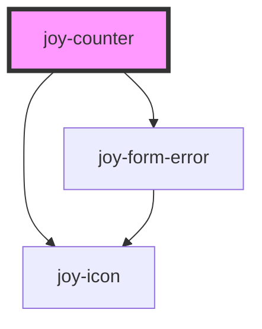

## Given input name
```ui_example
<joy-counter input-name="my-counter-name" step="10" count="10" max="5000"></joy-counter>
```

## Given input with error
```ui_example
<joy-counter invalid input-name="my-counter-name" count="5" step="10" min="10" invalid-message="Value is invalid !"></joy-counter>
```


<!-- Auto Generated Below -->


## Properties

| Property         | Attribute         | Description                                                                                                                                                                                                                                       | Type                  | Default                             |
| ---------------- | ----------------- | ------------------------------------------------------------------------------------------------------------------------------------------------------------------------------------------------------------------------------------------------- | --------------------- | ----------------------------------- |
| `ariaLabel`      | `aria-label`      | aria-label used for input accessibility. Use string only, no HTML. More than welcome !                                                                                                                                                            | `string`              | `''`                                |
| `invalid`        | `invalid`         | Invalid state of the component                                                                                                                                                                                                                    | `boolean`             | `false`                             |
| `invalidMessage` | `invalid-message` | Message when the component is invalid. Warning : by default, it will pick HTML5 validation message (the language is defined by your OS)                                                                                                           | `string`              | `''`                                |
| `labelDecrement` | `label-decrement` | Used for accessibility aria-label attribute. More than welcome !                                                                                                                                                                                  | `string`              | ``Decrement value by ${this.step}`` |
| `labelIncrement` | `label-increment` | Used for accessibility aria-label attribute. More than welcome !                                                                                                                                                                                  | `string`              | ``Increment value by ${this.step}`` |
| `max`            | `max`             | Maximum possible value. No default                                                                                                                                                                                                                | `number \| undefined` | `undefined`                         |
| `min`            | `min`             | Minimum possible value. Default to 0                                                                                                                                                                                                              | `number`              | `0`                                 |
| `name`           | `input-name`      | Name for the input                                                                                                                                                                                                                                | `string`              | `''`                                |
| `required`       | `required`        | Counter requirement                                                                                                                                                                                                                               | `boolean`             | `false`                             |
| `step`           | `step`            | Granularity of the input. We use the same name than native step attribute. We don't bind this prop to actual input step attribute, because we don't want checkValidity API to return invalid if the actual value is not a multiple of step prop ! | `number`              | `1`                                 |
| `value`          | `value`           |                                                                                                                                                                                                                                                   | `number`              | `0`                                 |


## Events

| Event                 | Description                                                                                                                            | Type                                               |
| --------------------- | -------------------------------------------------------------------------------------------------------------------------------------- | -------------------------------------------------- |
| `joyCounterDecrement` | Specific event fired when you decrement the counter value. Prefer using valueChange unless you need to handle this specific event type | `CustomEvent<number>`                              |
| `joyCounterIncrement` | Specific event fired when you increment the counter value. Prefer using valueChange unless you need to handle this specific event type | `CustomEvent<number>`                              |
| `joyCounterInvalid`   | Specific event fired when your counter value is invalid.                                                                               | `CustomEvent<{ value: string; message: string; }>` |
| `valueChange`         | Generic event for any counter change, fired by manually typing a value or using increment/decrement CTA                                | `CustomEvent<number>`                              |


## CSS Custom Properties

| Name                     | Description                                                                  |
| ------------------------ | ---------------------------------------------------------------------------- |
| `--counter-items-height` | Set a new value for this property, and it will resize both buttons and input |


## Dependencies

### Depends on

- [joy-icon](../icon)
- [joy-form-error](../form-error)

### Graph


----------------------------------------------

*Built with [StencilJS](https://stenciljs.com/)*
