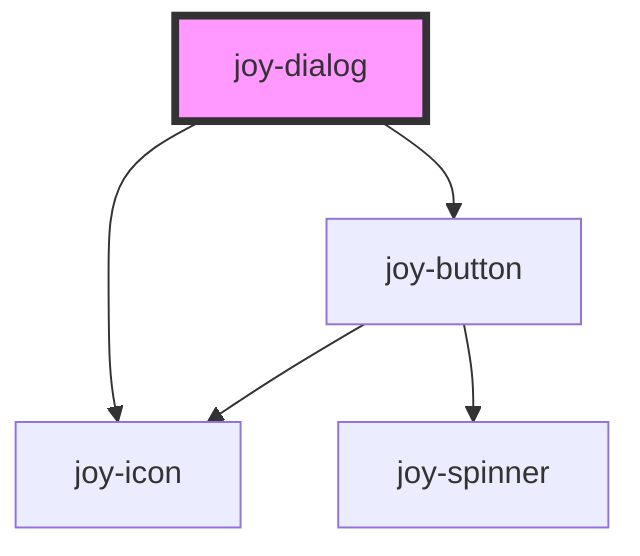

```ui_example

<joy-dialog-trigger dialog="myDialog">
    <joy-button size="xsmall">Show dialog</joy-button>
</joy-dialog-trigger>

<joy-dialog id="myDialog" data-dialog="myDialog" aria-labelledby="myDialogTitle">
    <p id="myDialogTitle" slot="dialog-header">I am the dialog header</p>
     <p slot="dialog-subheader">I am the dialog subheader</p>
    <div slot="dialog-body">
        <joy-text>
             I am the dialog body content with <strong>strong content</strong> and 
            <joy-link href="#">some links</joy-link> to test the style.
        </joy-text> 
    </div>
</joy-dialog>
```

<joy-highlight level="warning" accent display-icon>
    For accessibility purpose, you need to set your own ID on the the dialog-header slot, in order to use aria-labelledby on the joy-dialog tag.
</joy-highlight>

### Chaining Dialogs

```ui_example

<joy-dialog-trigger dialog="myDialogChain1">
    <joy-button size="xsmall">Show dialog</joy-button>
</joy-dialog-trigger>

<joy-dialog id="myDialogChain1">
    <p slot="dialog-header">I am the first dialog title</p>
     <p slot="dialog-subheader">I am the first dialog subheader</p>
    <div slot="dialog-body">
        <joy-text>
             I am the the first dialog body content with <strong>strong content</strong> and 
            <joy-link href="#">some links</joy-link> to test the style.
        </joy-text> 
    </div>
    <joy-indicators slot="dialog-indicators">
        <joy-dialog-trigger dialog="myDialogChain1">
            <joy-indicator selected></joy-indicator>
        </joy-dialog-trigger>
        <joy-dialog-trigger dialog="myDialogChain2">
            <joy-indicator></joy-indicator>
        </joy-dialog-trigger>
    </joy-indicators>
</joy-dialog>

<joy-dialog id="myDialogChain2"  banner-src="https://www.telerama.fr/sites/tr_master/files/styles/simplecrop1000/public/telerama_011427_050_0.jpg?itok=NUBggDPI">
    <p slot="dialog-header">I am the second dialog title</p>
     <p slot="dialog-subheader">I am the second dialog subheader</p>
    <div slot="dialog-body">
        <joy-text>
             I am the dialog body content with <strong>strong content</strong> and 
            <joy-link href="#">some links</joy-link> to test the style.
        </joy-text> 
    </div>
    <joy-indicators slot="dialog-indicators">
        <joy-dialog-trigger dialog="myDialogChain1">
            <joy-indicator></joy-indicator>
        </joy-dialog-trigger>
        <joy-dialog-trigger dialog="myDialogChain2">
            <joy-indicator selected></joy-indicator>
        </joy-dialog-trigger>
    </joy-indicators>
</joy-dialog>
```


### Preview

<joy-highlight level="warning">
    This preview with "demo" attribute is for documentation purpose. You can't close the dialog.
</joy-highlight>

```ui_example
<joy-dialog open id="myDemoDialog" demo confirm-text="Submit" cancel-text="Cancel">
    <p slot="dialog-header">I am the dialog header</p>
    <p slot="dialog-subheader">I am the dialog subheader</p>
    <div slot="dialog-body">
        <joy-text>
             I am the dialog body content with <strong>strong content</strong> and 
            <joy-link href="#">some links</joy-link> to test the style.
        </joy-text> 
    </div>
</joy-dialog>
```

```ui_example
<joy-dialog open id="myDemoDialog2" demo confirm-text="Submit" cancel-text="Cancel" banner-src="https://www.telerama.fr/sites/tr_master/files/styles/simplecrop1000/public/telerama_011427_050_0.jpg?itok=NUBggDPI">
    <p slot="dialog-header">I am the dialog header</p>
    <p slot="dialog-subheader">I am the dialog subheader</p>
    <div slot="dialog-body">
        <joy-text>
             I am the dialog body content with <strong>strong content</strong> and 
            <joy-link href="#">some links</joy-link> to test the style.
        </joy-text> 
    </div>
</joy-dialog>
```

<!-- Auto Generated Below -->


## Properties

| Property         | Attribute         | Description                                                                                                                                                                                                                                                                   | Type                                         | Default     |
| ---------------- | ----------------- | ----------------------------------------------------------------------------------------------------------------------------------------------------------------------------------------------------------------------------------------------------------------------------- | -------------------------------------------- | ----------- |
| `appendBackdrop` | `append-backdrop` | Choose whether backdrop is injected at the root of the body or next to the dialog itself. If a parent element has some media queries rules and is getting hidden at some point, injecting the backdrop next to the dialog is a good way to prevent issues. Default to body. * | `"body" \| "sibling"`                        | `'body'`    |
| `bannerHeight`   | `banner-height`   | Set the height of the banner. Default to 250 *                                                                                                                                                                                                                                | `number \| undefined`                        | `250`       |
| `bannerPosition` | `banner-position` | Set the position of the banner image. Work exactly like css background-position property *                                                                                                                                                                                    | `string`                                     | `'center'`  |
| `bannerSrc`      | `banner-src`      | Set the URL of the image you can inject as pre-header banner *                                                                                                                                                                                                                | `string \| undefined`                        | `undefined` |
| `bannerSrcAlt`   | `banner-src-alt`  | Set the alt text of the banner *                                                                                                                                                                                                                                              | `string \| undefined`                        | `undefined` |
| `buttonSize`     | `button-size`     | If you want to change the CTA sizes, please choose between small, medium, large *                                                                                                                                                                                             | `"large" \| "medium" \| "small" \| "xsmall"` | `'small'`   |
| `cancelText`     | `cancel-text`     | Secondary CTA text. If none given, it won't show the CTA *                                                                                                                                                                                                                    | `string \| undefined`                        | `undefined` |
| `confirmText`    | `confirm-text`    | Main CTA text. If none given, it won't show the CTA *                                                                                                                                                                                                                         | `string \| undefined`                        | `undefined` |
| `open`           | `open`            | Dialog open state *                                                                                                                                                                                                                                                           | `boolean`                                    | `false`     |
| `size`           | `size`            | Dialog sizes *                                                                                                                                                                                                                                                                | `"default" \| "large"`                       | `'default'` |


## Events

| Event              | Description                                                     | Type                |
| ------------------ | --------------------------------------------------------------- | ------------------- |
| `joyCancelDialog`  | Custom event fired when clicking on cancel button or cross icon | `CustomEvent<void>` |
| `joyConfirmDialog` | Custom event fired when clicking on confirm button              | `CustomEvent<void>` |


## Methods

### `closeDialog() => Promise<void>`

Hide the dialog from outside

#### Returns

Type: `Promise<void>`


### `openDialog(callback?: (() => any) | undefined) => Promise<void>`

If you want to trigger specific action after the dialog opening.

#### Returns

Type: `Promise<void>`


## Slots

| Slot                 | Description                                                                                      |
| -------------------- | ------------------------------------------------------------------------------------------------ |
| `"dialog-body"`      | The dialog main content                                                                          |
| `"dialog-cancel"`    | If you need to customize the cancel CTA (with any attribute for a specific need), use this slot  |
| `"dialog-confirm"`   | If you need to customize the confirm CTA (with any attribute for a specific need), use this slot |
| `"dialog-header"`    | The dialog title                                                                                 |
| `"dialog-subheader"` | The dialog subtitle                                                                              |


## Dependencies

### Depends on

- [joy-icon](../icon)
- [joy-button](../button)

### Graph


----------------------------------------------

*Built with [StencilJS](https://stenciljs.com/)*
