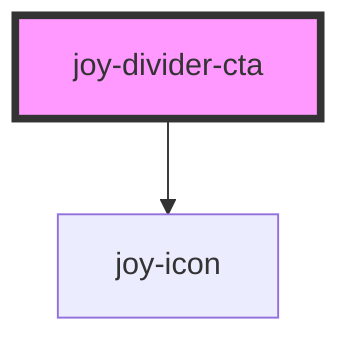

```ui_example
<joy-divider-cta>
    Add a form instance here
    <span slot="divider-content">Add a form in order to do something specific</span>
</joy-divider-cta>
```

```ui_example
<joy-divider-cta disabled>
    You can't add a form instance here
</joy-divider-cta>
```

<!-- Auto Generated Below -->


## Properties

| Property   | Attribute  | Description     | Type      | Default |
| ---------- | ---------- | --------------- | --------- | ------- |
| `disabled` | `disabled` | Disabled or not | `boolean` | `false` |


## Shadow Parts

| Part        | Description |
| ----------- | ----------- |
| `"divider"` |             |


## Dependencies

### Depends on

- [joy-icon](../icon)

### Graph


----------------------------------------------

*Built with [StencilJS](https://stenciljs.com/)*
