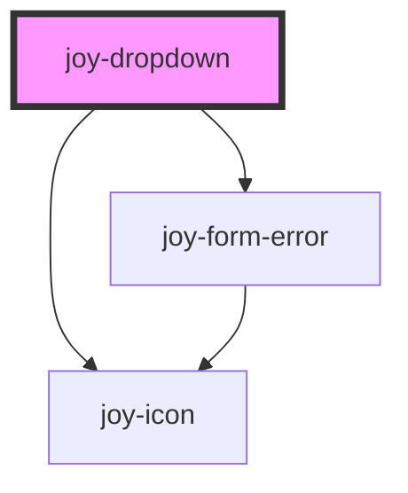

```ui_example
<joy-dropdown icon="filter">
    <joy-option disabled selected>Choose your option...</joy-option>
    <joy-option value="first">First option</joy-option>
    <joy-option value="second">Second option</joy-option>
    <joy-option value="third">Third option</joy-option>
    <joy-option value="fourth">Fourth option</joy-option>
    <joy-option value="fifth">Fifth option</joy-option>
</joy-dropdown>
```

## States 

```ui_example
<joy-dropdown icon="filter" disabled>
    <joy-option disabled selected>Choose your option...</joy-option>
    <joy-option value="first">First option</joy-option>
    <joy-option value="second">Second option</joy-option>
    <joy-option value="third">Third option</joy-option>
</joy-dropdown>
```

```ui_example
<joy-dropdown icon="filter" invalid invalid-message="The field is required, please dropdown a value">
    <joy-option disabled selected>Choose your option...</joy-option>
    <joy-option value="first">First option</joy-option>
    <joy-option value="second">Second option</joy-option>
    <joy-option value="third">Third option</joy-option>
</joy-dropdown>
```

<!-- Auto Generated Below -->


## Properties

| Property         | Attribute         | Description                                                                                                                                    | Type                  | Default               |
| ---------------- | ----------------- | ---------------------------------------------------------------------------------------------------------------------------------------------- | --------------------- | --------------------- |
| `closeOnBlur`    | `close-on-blur`   | By default, the dropdown is closed if you focusout the dropdown. For debugging purpose or specific behavior, you can toggle off this option. * | `boolean`             | `true`                |
| `disabled`       | `disabled`        | Disabled state. *                                                                                                                              | `boolean`             | `false`               |
| `icon`           | `icon`            | Pick an icon displayed before the label. *                                                                                                     | `string \| undefined` | `undefined`           |
| `invalid`        | `invalid`         | Invalid state. *                                                                                                                               | `boolean`             | `false`               |
| `invalidMessage` | `invalid-message` | Invalid state message. *                                                                                                                       | `string`              | `'Field is required'` |
| `name`           | `name`            | Select name attribute to be found by parent form. *                                                                                            | `string`              | `'dropdown'`          |
| `required`       | `required`        | Mandatory or not. *                                                                                                                            | `boolean`             | `false`               |
| `value`          | `value`           | Select actual value. *                                                                                                                         | `string`              | `''`                  |


## Events

| Event         | Description | Type                              |
| ------------- | ----------- | --------------------------------- |
| `valueChange` |             | `CustomEvent<{ value: string; }>` |


## Dependencies

### Depends on

- [joy-icon](../icon)
- [joy-form-error](../form-error)

### Graph


----------------------------------------------

*Built with [StencilJS](https://stenciljs.com/)*
