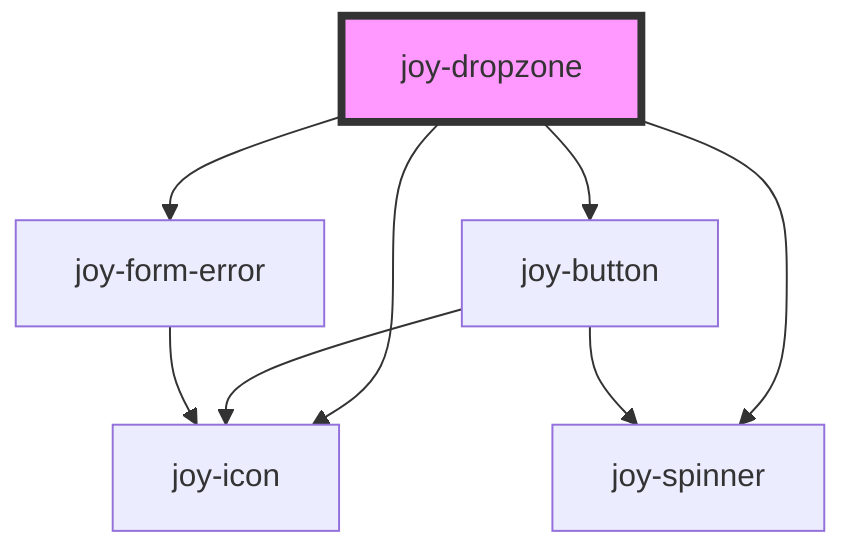

```ui_example
<joy-dropzone id-dropzone="dropzone-1" accept="image/png, image/jpeg" legend="lorem ipsum bla bla"></joy-dropzone>
<br/>
<joy-dropzone id-dropzone="dropzone-2" accept="image/png, image/jpeg" invalid></joy-dropzone>
<br/>
<joy-dropzone id-dropzone="dropzone-3" accept="image/png, image/jpeg" disabled></joy-dropzone>
```

<!-- Auto Generated Below -->


## Properties

| Property                | Attribute                 | Description                                                             | Type                          | Default                               |
| ----------------------- | ------------------------- | ----------------------------------------------------------------------- | ----------------------------- | ------------------------------------- |
| `accept`                | `accept`                  | Add accepted file formats                                               | `string`                      | `''`                                  |
| `buttonCancelText`      | `button-cancel-text`      | Add CTA Cancellation Text                                               | `string`                      | `'Cancel'`                            |
| `buttonText`            | `button-text`             | Add CTA Upload Text                                                     | `string`                      | `'Upload'`                            |
| `descriptionStrongText` | `description-strong-text` | Add description Text                                                    | `string`                      | `'click here'`                        |
| `descriptionText`       | `description-text`        | Add description Text                                                    | `string`                      | `'Drop your file here or click here'` |
| `disabled`              | `disabled`                | Makes the dropzone disabled or not                                      | `boolean`                     | `false`                               |
| `errorTextFormat`       | `error-text-format`       | Add custom error message when uploaded file format is not accepted      | `string`                      | `''`                                  |
| `errorTextMaxSize`      | `error-text-max-size`     | Add custom error message when uploaded file size is bigger than maxSize | `string`                      | `''`                                  |
| `idDropzone`            | `id-dropzone`             | set a unique id for the input file                                      | `string \| undefined`         | `undefined`                           |
| `invalid`               | `invalid`                 | Makes the dropzone invalid or not                                       | `boolean`                     | `false`                               |
| `legend`                | `legend`                  | Add legend/specification text                                           | `null \| string \| undefined` | `undefined`                           |
| `loading`               | `loading`                 | Make the dropzone in progress state or not                              | `boolean`                     | `false`                               |
| `maxSize`               | `max-size`                | set MaxSize (Megabytes), default to 32 MB                               | `number`                      | `32`                                  |
| `multiple`              | `multiple`                | Enable multiple files upload                                            | `boolean`                     | `false`                               |
| `uploadingText`         | `uploading-text`          | Add Uploading Text                                                      | `string`                      | `'Uploading... hang tight.'`          |


## Events

| Event                             | Description | Type                          |
| --------------------------------- | ----------- | ----------------------------- |
| `joy-dropzone-cancel-upload-file` |             | `CustomEvent<File[] \| null>` |
| `joy-dropzone-invalidate-file`    |             | `CustomEvent<File[] \| null>` |
| `joy-dropzone-remove-file`        |             | `CustomEvent<File \| null>`   |
| `joy-dropzone-validate-file`      |             | `CustomEvent<File[] \| null>` |


## Methods

### `isLoading(loading: boolean) => Promise<void>`

set In progress state

#### Returns

Type: `Promise<void>`


## Dependencies

### Depends on

- [joy-button](../button)
- [joy-icon](../icon)
- [joy-spinner](../spinner)
- [joy-form-error](../form-error)

### Graph


----------------------------------------------

*Built with [StencilJS](https://stenciljs.com/)*
