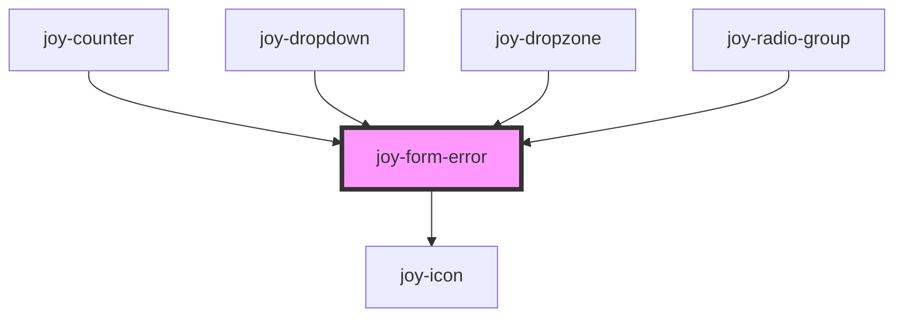

```ui_example
<joy-form-error no-html-error-text="The field is required"></joy-form-error>
```

<joy-highlight level="info" accent>If you need to display multiple errors, for example with a ul/li </joy-highlight>

```ui_example
<joy-form-error>
    <ul>
        <li>The field is required</li>
        <li>Another error</li>
    </ul>
</joy-form-error>
```


<!-- Auto Generated Below -->


## Properties

| Property          | Attribute            | Description                                                                                                                                  | Type                  | Default     |
| ----------------- | -------------------- | -------------------------------------------------------------------------------------------------------------------------------------------- | --------------------- | ----------- |
| `noHtmlErrorText` | `no-html-error-text` | The error text. Plain string required as any HTML injected will be escaped                                                                   | `string \| undefined` | `undefined` |
| `visible`         | `visible`            | Depending on contexts : maybe you'll need to insert it in the DOM but hide it, or injecting it into the DOM on the fly (like Vue v-if cases) | `boolean`             | `true`      |


## Slots

| Slot        | Description                                                                                                         |
| ----------- | ------------------------------------------------------------------------------------------------------------------- |
| `"default"` | Use it to inject plain HTML error message (or if you can't access the string due to any backend framework handling) |


## CSS Custom Properties

| Name                 | Description              |
| -------------------- | ------------------------ |
| `--form-error-color` | color for the error text |


## Dependencies

### Used by

 - [joy-counter](../counter)
 - [joy-dropdown](../dropdown)
 - [joy-dropzone](../dropzone)
 - [joy-radio-group](../radio-group)

### Depends on

- [joy-icon](../icon)

### Graph


----------------------------------------------

*Built with [StencilJS](https://stenciljs.com/)*
