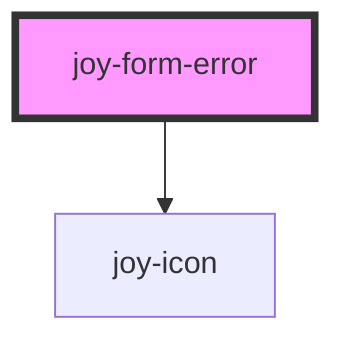

```ui_example
<joy-form-error></joy-form-error>
<joy-form-error no-html-error-text="The field is required"></joy-form-error>
```


<!-- Auto Generated Below -->


## Properties

| Property          | Attribute            | Description                                                                                                                                  | Type      | Default     |
| ----------------- | -------------------- | -------------------------------------------------------------------------------------------------------------------------------------------- | --------- | ----------- |
| `noHtmlErrorText` | `no-html-error-text` | The error text. Plain string required as any HTML injected will be escaped                                                                   | `string`  | `'Error !'` |
| `visible`         | `visible`            | Depending on contexts : maybe you'll need to insert it in the DOM but hide it, or injecting it into the DOM on the fly (like Vue v-if cases) | `boolean` | `true`      |


## CSS Custom Properties

| Name                 | Description              |
| -------------------- | ------------------------ |
| `--form-error-color` | color for the error text |


## Dependencies

### Depends on

- [joy-icon](../icon)

### Graph


----------------------------------------------

*Built with [StencilJS](https://stenciljs.com/)*
