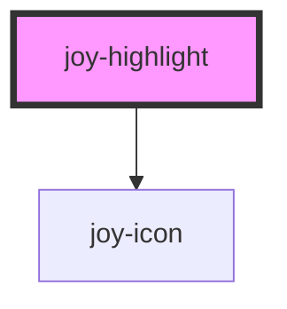

## Default 
If no level given, the fallback is the "neutral" version.

```ui_example
<joy-highlight display-icon>Content without accent.</joy-highlight>
```

## Accent
Works with any level.

```ui_example
<joy-highlight level="info" display-icon>Content without accent.</joy-highlight>
<br/>
<joy-highlight level="info" display-icon accent>Content with accent.</joy-highlight>
```

## Levels

```ui_example
<joy-highlight level="warning" display-icon>I am a simple warning content</joy-highlight>
<joy-highlight level="error" display-icon>I am a simple error content.</joy-highlight>
<joy-highlight level="success" display-icon>I am a simple success content.</joy-highlight>
<joy-highlight level="info" display-icon>I am a simple info content.</joy-highlight>
<joy-highlight level="neutral" display-icon>I am a simple neutral content.</joy-highlight>
```

## Other properties

### Title

```ui_example
<joy-highlight level="warning" display-icon>
    <span slot="highlight-title">I am the title</span>
    I am a simple warning content
</joy-highlight>
```

### Customize icon

```ui_example
<joy-highlight level="success" display-icon icon="mood-good">You can use "icon" property to choose the icon you want.</joy-highlight>
```

<!-- Auto Generated Below -->


## Properties

| Property      | Attribute      | Description                                                                                                       | Type                                                       | Default     |
| ------------- | -------------- | ----------------------------------------------------------------------------------------------------------------- | ---------------------------------------------------------- | ----------- |
| `accent`      | `accent`       | Add the left border accent on the highlight.                                                                      | `boolean`                                                  | `false`     |
| `displayIcon` | `display-icon` | Allows to display the level status icon                                                                           | `boolean`                                                  | `false`     |
| `icon`        | `icon`         | Override the icon type used for level. Size can't be overridden. Won't show if displayIcon prop isn't set to true | `string \| undefined`                                      | `undefined` |
| `level`       | `level`        | Defines the criticalness of the highlight                                                                         | `"error" \| "info" \| "neutral" \| "success" \| "warning"` | `'neutral'` |


## Slots

| Slot        | Description                    |
| ----------- | ------------------------------ |
| `"default"` | Text content of your highlight |


## Dependencies

### Depends on

- [joy-icon](../icon)

### Graph


----------------------------------------------

*Built with [StencilJS](https://stenciljs.com/)*
