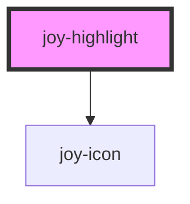

```ui_example
<joy-highlight level="warning" display-icon>I am a simple warning content</joy-highlight>
<joy-highlight level="error" display-icon>I am a simple error content.</joy-highlight>
<joy-highlight level="success" display-icon>I am a simple success content.</joy-highlight>
<joy-highlight level="info" display-icon>I am a simple info content.</joy-highlight>
```

## Customize icon

```ui_example
<joy-highlight level="success" display-icon icon="mood-good">You can use "icon" property to choose the icon you want.</joy-highlight>
```

<!-- Auto Generated Below -->


## Properties

| Property      | Attribute      | Description                                                                                                       | Type                                          | Default     |
| ------------- | -------------- | ----------------------------------------------------------------------------------------------------------------- | --------------------------------------------- | ----------- |
| `displayIcon` | `display-icon` | Allows to display the level status icon                                                                           | `boolean`                                     | `false`     |
| `icon`        | `icon`         | Override the icon type used for level. Size can't be overridden. Won't show if displayIcon prop isn't set to true | `string \| undefined`                         | `undefined` |
| `level`       | `level`        | Defines the criticalness of the highlight                                                                         | `"error" \| "info" \| "success" \| "warning"` | `'info'`    |


## Slots

| Slot        | Description                    |
| ----------- | ------------------------------ |
| `"default"` | Text content of your highlight |


## CSS Custom Properties

| Name                             | Description                        |
| -------------------------------- | ---------------------------------- |
| `--highlight-background-error`   | background color for ERROR state   |
| `--highlight-background-info`    | background color for INFO state    |
| `--highlight-background-success` | background color for SUCCESS state |
| `--highlight-background-warning` | background color for WARNING state |
| `--highlight-color-error`        | text color for ERROR state         |
| `--highlight-color-info`         | text color for INFO state          |
| `--highlight-color-success`      | text color for SUCCESS state       |
| `--highlight-color-warning`      | text color for WARNING state       |


## Dependencies

### Depends on

- [joy-icon](../icon)

### Graph


----------------------------------------------

*Built with [StencilJS](https://stenciljs.com/)*
