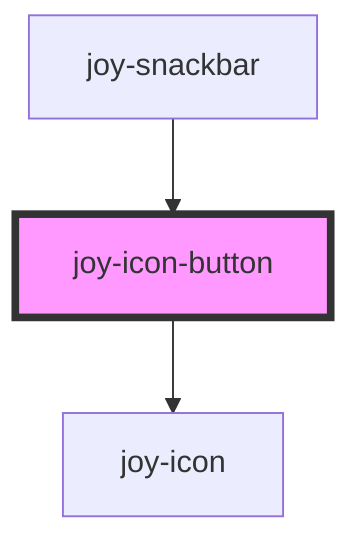

```ui_example
<joy-icon-button icon="cancel" arial-label="Close"></joy-icon-button>
```

```ui_example
<joy-icon-button icon="cancel" color="white" arial-label="Close"></joy-icon-button>
```


<!-- Auto Generated Below -->


## Properties

| Property | Attribute | Description                                                                                      | Type                    | Default     |
| -------- | --------- | ------------------------------------------------------------------------------------------------ | ----------------------- | ----------- |
| `color`  | `color`   | The icon color. Default is the blue version. You can only override it with the white version.    | `"white" \| undefined`  | `undefined` |
| `icon`   | `icon`    | The icon name                                                                                    | `string \| undefined`   | `undefined` |
| `type`   | `type`    | The button type. As the component wraps an actual HTML button element, it will be applied to it. | `"button" \| undefined` | `undefined` |


## Events

| Event                | Description                                                                                                                                         | Type                |
| -------------------- | --------------------------------------------------------------------------------------------------------------------------------------------------- | ------------------- |
| `joyIconButtonClick` | use @joyIconButtonClick="yourMethod" for Vue apps (onJoyIconButtonClick for other stencil components) to handle snackbar close. Nothing is returned | `CustomEvent<void>` |


## Slots

| Slot        | Description                                           |
| ----------- | ----------------------------------------------------- |
| `"default"` | allows you to directly use <joy-icon> with its params |


## Dependencies

### Used by

 - [joy-snackbar](../snackbar)

### Depends on

- [joy-icon](../icon)

### Graph


----------------------------------------------

*Built with [StencilJS](https://stenciljs.com/)*
