Please see <a href="/joy-v2/webcomponents.html#joy_icons_list">full icons list here</a>


```ui_example
<joy-icon name="bell"></joy-icon>
<joy-icon name="bell" color="grey"></joy-icon>
<joy-icon name="bell" color="red"></joy-icon>
<joy-icon name="bell" color="yellow"></joy-icon>
<joy-icon name="bell" color="turquoise"></joy-icon>
<joy-icon name="bell" color="white"></joy-icon>
<joy-icon name="bell" size="xxsmall"></joy-icon>
<joy-icon name="bell" size="xsmall"></joy-icon>
<joy-icon name="bell" size="small"></joy-icon>
<joy-icon name="bell" size="medium"></joy-icon>
<joy-icon name="bell" size="large"></joy-icon>
<joy-icon name="bell" size="xlarge"></joy-icon>
<joy-icon name="bell" bicolor="true"></joy-icon>
<joy-icon name="bell" full="true"></joy-icon>
<joy-icon name="bell" clickable="true"></joy-icon>
```

<!-- Auto Generated Below -->


## Properties

| Property      | Attribute      | Description                                                                                     | Type                                                                               | Default     |
| ------------- | -------------- | ----------------------------------------------------------------------------------------------- | ---------------------------------------------------------------------------------- | ----------- |
| `ariaLabel`   | `aria-label`   | Defines a non-visible legend                                                                    | `string / undefined`                                                              | `undefined` |
| `bicolor`     | `bicolor`      | Two-tone icon when set to true                                                                  | `boolean`                                                                          | `false`     |
| `clickable`   | `clickable`    | Color change on hover                                                                           | `boolean`                                                                          | `false`     |
| `color`       | `color`        | The icon color                                                                                  | `"grey" / "red" / "teal" / "turquoise" / "white" / "yellow" / undefined`     | `'teal'`    |
| `customClass` | `custom-class` | The icon custom class(es), if needed                                                            | `string / undefined`                                                              | `undefined` |
| `full`        | `full`         | Full colored icon when set to true                                                              | `boolean`                                                                          | `false`     |
| `lazy`        | `lazy`         | If enabled, ion-icon will be loaded lazily when it's visible in the viewport. Default, `false`. | `boolean`                                                                          | `true`      |
| `name`        | `name`         | The icon svg filename                                                                           | `string`                                                                           | `'bell'`    |
| `size`        | `size`         | The icon size                                                                                   | `"large" / "medium" / "small" / "xlarge" / "xsmall" / "xxsmall" / undefined` | `undefined` |


## Dependencies

### Used by

 - [joy-avatar](../avatar)
 - [joy-button](../button)
 - [joy-company-avatar](../company-avatar)
 - [joy-counter](../counter)
 - [joy-dialog](../dialog)
 - [joy-form-error](../form-error)
 - [joy-highlight](../highlight)
 - [joy-icon-button](../icon-button)
 - [joy-input](../input)
 - [joy-link](../link)
 - [joy-pagination](../pagination)
 - [joy-placeholder-button](../placeholder-button)
 - [joy-select](../select)
 - [joy-snackbar](../snackbar)
 - [joy-tag](../tag)
 - [joy-textarea](../textarea)
 - [joy-tips](../tips)

### Graph

```mermaid
graph TD;
  joy-avatar --> joy-icon
  joy-button --> joy-icon
  joy-company-avatar --> joy-icon
  joy-counter --> joy-icon
  joy-dialog --> joy-icon
  joy-form-error --> joy-icon
  joy-highlight --> joy-icon
  joy-icon-button --> joy-icon
  joy-input --> joy-icon
  joy-link --> joy-icon
  joy-pagination --> joy-icon
  joy-placeholder-button --> joy-icon
  joy-select --> joy-icon
  joy-snackbar --> joy-icon
  joy-tag --> joy-icon
  joy-textarea --> joy-icon
  joy-tips --> joy-icon
  style joy-icon fill:#f9f,stroke:#333,stroke-width:4px
```


----------------------------------------------

*Built with [StencilJS](https://stenciljs.com/)*
