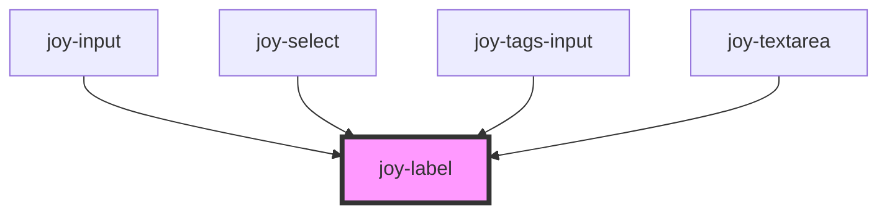

# joy-label

<!-- Auto Generated Below -->

## Properties

| Property        | Attribute        | Description                                                                                                | Type                  | Default     |
| --------------- | ---------------- | ---------------------------------------------------------------------------------------------------------- | --------------------- | ----------- |
| `htmlFor`       | `html-for`       | for attribute to associate label to an input *                                                             | `string \| undefined` | `undefined` |
| `optionalLabel` | `optional-label` | Inject the right wording if your field is not required. the "-" separator is already handled internally. * | `string \| undefined` | `undefined` |
| `required`      | `required`       | Required status of parent form field *                                                                     | `boolean`             | `false`     |
| `size`          | `size`           | Label size *                                                                                               | `"large" \| "medium"` | `'medium'`  |

## CSS Custom Properties

| Name                | Description            |
| ------------------- | ---------------------- |
| `--label-font-size` | font-size of the label |

## Dependencies

### Used by

 - [joy-input](../input)
 - [joy-select](../select)
 - [joy-tags-input](../tags-input)
 - [joy-textarea](../textarea)

### Graph

----------------------------------------------

*Built with [StencilJS](https://stenciljs.com/)*
