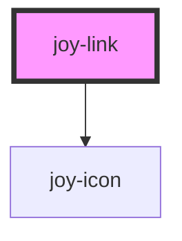

```ui_example
<joy-link href="https://malt.fr" icon="pen" target="_blank">I am a link with an icon</joy-link>
```

## Darker background

<div style="background-color: #014554; padding: 20px;">
<joy-link theme="white" icon="pen" href="https://malt.fr" target="_blank">I am a link</joy-link>
<joy-link theme="white" href="https://malt.fr" target="_blank" icon="pen">I am a link with a pen</joy-link>
</div> 

```ui_code_example
<joy-link theme="white" href="https://malt.fr" target="_blank">I am a link</joy-link>
<joy-link theme="white" href="https://malt.fr" target="_blank" icon="pen">I am a link with a pen</joy-link>
```

<!-- Auto Generated Below -->


## Properties

| Property   | Attribute  | Description                                                                                            | Type                                                      | Default     |
| ---------- | ---------- | ------------------------------------------------------------------------------------------------------ | --------------------------------------------------------- | ----------- |
| `download` | `download` | Filename of the downloadable content                                                                   | `string \| undefined`                                     | `undefined` |
| `href`     | `href`     | Set the href of your link                                                                              | `string \| undefined`                                     | `undefined` |
| `icon`     | `icon`     | Icon name if you want to display one, before the text                                                  | `string \| undefined`                                     | `undefined` |
| `rel`      | `rel`      | Native rel attribute for hyperlinks. See https://developer.mozilla.org/fr/docs/Web/HTML/Attributes/rel | `string \| undefined`                                     | `undefined` |
| `target`   | `target`   | Native target attribute for hyperlinks.                                                                | `"_blank" \| "_parent" \| "_self" \| "_top" \| undefined` | `undefined` |
| `theme`    | `theme`    | Color theme. Default is teal, you can set white theme for darker backgrounds.                          | `"teal" \| "white"`                                       | `'teal'`    |


## Dependencies

### Depends on

- [joy-icon](../icon)

### Graph


----------------------------------------------

*Built with [StencilJS](https://stenciljs.com/)*
