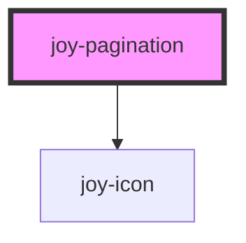

```ui_example
<joy-pagination total-pages="10" current-page="4"></joy-pagination>
```

## Recommended for complex HTML (tracking, signup...) and non SPA context
Use slots in order to prevent too many custom attributes. Keep the same HTML structure as below, and customize with any data-attribute you need

```ui_example
<joy-pagination total-pages="10" current-page="4">
    <a href="#" slot="pagination-prev">
        <joy-icon name="chevron-left"></joy-icon>
    </a>
    
    <ul slot="pagination-pages">
        <li><button type="button">1</button><li>
        <li><button type="button">2</button><li>
        <li><button type="button">3</button><li>
    </ul>
    
    <a href="#" slot="pagination-next">
        <joy-icon name="chevron-right"></joy-icon>
    </a>
</joy-pagination>
```

<!-- Auto Generated Below -->


## Properties

| Property          | Attribute          | Description                                                                                                                  | Type                  | Default     |
| ----------------- | ------------------ | ---------------------------------------------------------------------------------------------------------------------------- | --------------------- | ----------- |
| `currentPage`     | `current-page`     | Current page number                                                                                                          | `number`              | `1`         |
| `heapNext`        | `heap-next`        | data-heap attribute for next CTA. We should avoid as much as possible to use this kind of props inside the webcomponents     | `string \| undefined` | `undefined` |
| `heapPrev`        | `heap-prev`        | data-heap attribute for previous CTA. We should avoid as much as possible to use this kind of props inside the webcomponents | `string \| undefined` | `undefined` |
| `labelNext`       | `label-next`       | Can be used as title and aria-label attributes for the next CTA                                                              | `string \| undefined` | `''`        |
| `labelPagination` | `label-pagination` | Can be used as aria-label attribute for the full component                                                                   | `string \| undefined` | `undefined` |
| `labelPrev`       | `label-prev`       | Can be used as title and aria-label attributes for the previous CTA                                                          | `string \| undefined` | `''`        |
| `linkNext`        | `link-next`        | For synchrone implementations (not SPA, basically), allows to inject the URL for next CTA                                    | `string \| undefined` | `undefined` |
| `linkPrev`        | `link-prev`        | For synchrone implementations (not SPA, basically), allows to inject the URL for previous CTA                                | `string \| undefined` | `undefined` |
| `totalPages`      | `total-pages`      | Total number of pages in order to construct the pagination                                                                   | `number`              | `1`         |


## Events

| Event           | Description                                                                                         | Type                  |
| --------------- | --------------------------------------------------------------------------------------------------- | --------------------- |
| `joyChangePage` | use @joyChangePage="yourMethod" for Vue apps, to handle pagination change. Clicked page is returned | `CustomEvent<number>` |


## Slots

| Slot                 | Description                                                                                          |
| -------------------- | ---------------------------------------------------------------------------------------------------- |
| `"pagination-next"`  | Link to go to next page. Use if it contains too many custom attributes for tracking or whatever.     |
| `"pagination-pages"` | Loop over your pages. Use if it contains too many custom attributes for tracking or whatever.        |
| `"pagination-prev"`  | Link to go to previous page. Use if it contains too many custom attributes for tracking or whatever. |


## Dependencies

### Depends on

- [joy-icon](../icon)

### Graph


----------------------------------------------

*Built with [StencilJS](https://stenciljs.com/)*
