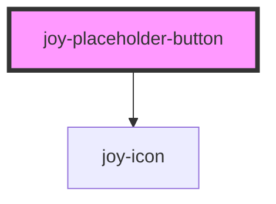

```ui_example
<joy-placeholder-button></joy-placeholder-button>
```

<!-- Auto Generated Below -->


## Properties

| Property | Attribute | Description               | Type                             | Default    |
| -------- | --------- | ------------------------- | -------------------------------- | ---------- |
| `size`   | `size`    | Placeholder button sizes. | `"large" \| "medium" \| "small"` | `'medium'` |


## Events

| Event                          | Description                                                 | Type                |
| ------------------------------ | ----------------------------------------------------------- | ------------------- |
| `joy-placeholder-button-click` | use @joy-placeholder-button-click="yourMethod" for Vue apps | `CustomEvent<void>` |


## CSS Custom Properties

| Name                                      | Description                        |
| ----------------------------------------- | ---------------------------------- |
| `--placeholder-button-bg-color`           | keyboard focus outline color       |
| `--placeholder-button-border-color`       | color of dashed button             |
| `--placeholder-button-border-color-focus` | main background color              |
| `--placeholder-button-size`               | set the width/height of the button |


## Dependencies

### Depends on

- [joy-icon](../icon)

### Graph


----------------------------------------------

*Built with [StencilJS](https://stenciljs.com/)*
