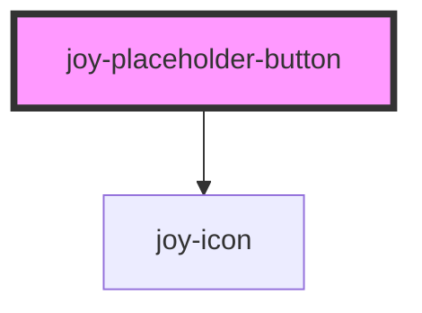

```ui_example
<joy-placeholder-button></joy-placeholder-button>
```

## Sizes 

```ui_example
<joy-placeholder-button size="small"></joy-placeholder-button>
<joy-placeholder-button size="medium"></joy-placeholder-button>
<joy-placeholder-button size="large"></joy-placeholder-button>
```

<!-- Auto Generated Below -->


## Properties

| Property | Attribute | Description               | Type                             | Default    |
| -------- | --------- | ------------------------- | -------------------------------- | ---------- |
| `size`   | `size`    | Placeholder button sizes. | `"large" \| "medium" \| "small"` | `'medium'` |


## Events

| Event                       | Description                                              | Type                |
| --------------------------- | -------------------------------------------------------- | ------------------- |
| `joyPlaceholderButtonClick` | use @joyPlaceholderButtonClick="yourMethod" for Vue apps | `CustomEvent<void>` |


## Dependencies

### Depends on

- [joy-icon](../icon)

### Graph


----------------------------------------------

*Built with [StencilJS](https://stenciljs.com/)*
