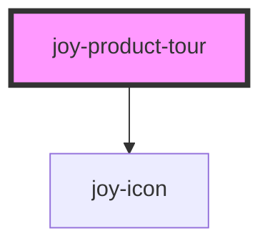

<joy-tag variant="important">EXPERIMENTAL</joy-tag>

```ui_example

<joy-product-tour-trigger product-tour="myProductTour">
    <joy-button variant="main">Run product tour manually</joy-button>
</joy-product-tour-trigger>

<joy-button variant="primary" id="myProductTourHighlighted">I am the next feature highlighted</joy-button>

<!-- First step product tour -->
<joy-product-tour id="myProductTour" icon="medal-thumbsup" steps="2" step="1" position="bottom">
    <joy-tags-list slot="product-tour-preheader">
        <joy-tag variant="primary">I am a tag</joy-tag>
        <joy-tag variant="pricing">I am another tag</joy-tag>
    </joy-tags-list>
    
    <div slot="product-tour-header">
        I am the product tour title
    </div>
    
    <p slot="product-tour-content">Lorem ipsum</p>
    
    <joy-button size="small" variant="ghost" slot="product-tour-dismiss">Got it</joy-button>
    <joy-product-tour-trigger product-tour="myProductTour2" slot="product-tour-next" target="#myProductTourHighlighted">
        <joy-button size="small" variant="primary">Next</joy-button>
    </joy-product-tour-trigger>
</joy-product-tour>


<!-- Second step product tour -->
<joy-product-tour id="myProductTour2" icon="medal-thumbsup" steps="2" step="2" position="bottom">    
    <div slot="product-tour-header">
        I am the product tour title of the second step
    </div>
    
    <p slot="product-tour-content">Lorem ipsum</p>
    
    <joy-button size="small" variant="ghost" slot="product-tour-dismiss">Got it</joy-button>
    <joy-button size="small" variant="main" slot="product-tour-dismiss">Thanks</joy-button>
</joy-product-tour>
```

<!-- Auto Generated Below -->


## Properties

| Property      | Attribute      | Description                                                                                                                                                                                             | Type                                     | Default          |
| ------------- | -------------- | ------------------------------------------------------------------------------------------------------------------------------------------------------------------------------------------------------- | ---------------------------------------- | ---------------- |
| `dismissedBy` | `dismissed-by` | Product-tour can be hidden by 3 elements by default, dismiss bottom CTA, top-right corner icon, and backdrop. If you don't want the backdrop click to close the product-tour, use "not-backdrop" value. | `"all" \| "not-backdrop"`                | `'not-backdrop'` |
| `icon`        | `icon`         | Icon name, placed left to the title                                                                                                                                                                     | `string \| undefined`                    | `undefined`      |
| `maxWidth`    | `max-width`    | Set a max width for your container                                                                                                                                                                      | `number \| undefined`                    | `500`            |
| `open`        | `open`         | Product tour open state                                                                                                                                                                                 | `boolean`                                | `false`          |
| `position`    | `position`     | Product tour position according to highlighted content                                                                                                                                                  | `"bottom" \| "left" \| "right" \| "top"` | `'right'`        |
| `step`        | `step`         | If multiple product tour are need, specify the current step number                                                                                                                                      | `number \| undefined`                    | `1`              |
| `steps`       | `steps`        | If multiple product tour are need, specify the amount                                                                                                                                                   | `number \| undefined`                    | `undefined`      |


## Events

| Event                      | Description | Type                                     |
| -------------------------- | ----------- | ---------------------------------------- |
| `joy-product-tour-dismiss` |             | `CustomEvent<HTMLJoyProductTourElement>` |


## Methods

### `closeProductTour() => Promise<void>`


#### Returns

Type: `Promise<void>`


### `showProductTour<T>(fromElement: HTMLElement, callback?: (() => T) | undefined) => Promise<void>`


#### Returns

Type: `Promise<void>`


## Slots

| Slot                       | Description                                                                                                      |
| -------------------------- | ---------------------------------------------------------------------------------------------------------------- |
| `"product-tour-content"`   | The product-tour main content                                                                                    |
| `"product-tour-dismiss"`   | Product-tour CTA made to cancel component. Can be used multiple times if needed                                  |
| `"product-tour-header"`    | The product-tour main title                                                                                      |
| `"product-tour-next"`      | Product-tour CTA made to trigger another product-tour instance. Use joy-product-tour-trigger component for this. |
| `"product-tour-preheader"` | If you need to insert specific content before the actual title                                                   |


## CSS Custom Properties

| Name                                            | Description |
| ----------------------------------------------- | ----------- |
| `--product-tour-width - product tour max width` |             |


## Dependencies

### Depends on

- [joy-icon](../icon)

### Graph


----------------------------------------------

*Built with [StencilJS](https://stenciljs.com/)*
