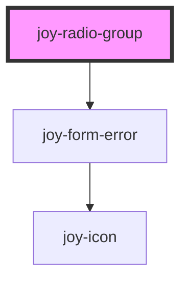

```ui_example
<joy-radio-group name="my-radio" value="first">
    <joy-radio value="first">First value</joy-radio>
    <joy-radio value="second">Second value</joy-radio>
    <joy-radio value="third">Third value</joy-radio>
</joy-radio-group>
```

```ui_example
<joy-radio-group name="my-radio" value="first">
    <span slot="radio-group-legend">I am the legend used in slot</span>
    <joy-radio value="first">First value</joy-radio>
    <joy-radio value="second">Second value</joy-radio>
    <joy-radio value="third">Third value</joy-radio>
</joy-radio-group>
```

```ui_example
<joy-radio-group direction="vertical" name="my-radio" value="first">
    <span slot="radio-group-legend">You can display your radios vertically as well</span>
    <joy-radio value="first">First value</joy-radio>
    <joy-radio value="second">Second value</joy-radio>
    <joy-radio value="third">Third value</joy-radio>
</joy-radio-group>
```


## Disabled

```ui_example
<joy-radio-group name="my-radio" value="fourth">
    <joy-radio disabled value="first">First value</joy-radio>
    <joy-radio disabled value="second">Second value</joy-radio>
    <joy-radio disabled value="third">Third value</joy-radio>
    <joy-radio disabled value="fourth">Fourth value</joy-radio>
</joy-radio-group>
```

## Error

```ui_example
<joy-radio-group name="my-radio" invalid invalid-text="Please pick a value">
    <joy-radio value="first">First value</joy-radio>
    <joy-radio value="second">Second value</joy-radio>
    <joy-radio value="third">Third value</joy-radio>
    <joy-radio value="fourth">Fourth value</joy-radio>
</joy-radio-group>
```

<!-- Auto Generated Below -->


## Properties

| Property      | Attribute      | Description                                                     | Type                         | Default        |
| ------------- | -------------- | --------------------------------------------------------------- | ---------------------------- | -------------- |
| `direction`   | `direction`    | Label displayed for the whoe radio group.                       | `"horizontal" \| "vertical"` | `'horizontal'` |
| `invalid`     | `invalid`      | Invalid state of the radio group                                | `boolean`                    | `false`        |
| `invalidText` | `invalid-text` | Invalid message                                                 | `string \| undefined`        | `undefined`    |
| `name`        | `name`         | The name of the control, which is submitted with the form data. | `string`                     | `this.inputId` |
| `value`       | `value`        | the value of the radio group.                                   | `any`                        | `undefined`    |


## Events

| Event                      | Description                                                                                                                               | Type                              |
| -------------------------- | ----------------------------------------------------------------------------------------------------------------------------------------- | --------------------------------- |
| `joyRadioGroupValueChange` | Emitted when the value has changed. Use this specific event if you use expandable options containing various inputs.                      | `CustomEvent<{ value: string; }>` |
| `valueChange`              | Emitted when the value has changed. WARNING : this event has a generic name used by other form elements ! Using it can create conflicts ! | `CustomEvent<{ value: string; }>` |


## Slots

| Slot                  | Description                                                                       |
| --------------------- | --------------------------------------------------------------------------------- |
| `"default"`           | Use joy-radio tags with this slot (mandatory)                                     |
| `"radio-group-label"` | If you want to inject a label for your radio group, use this slot (not mandatory) |


## Dependencies

### Depends on

- [joy-form-error](../form-error)

### Graph


----------------------------------------------

*Built with [StencilJS](https://stenciljs.com/)*
