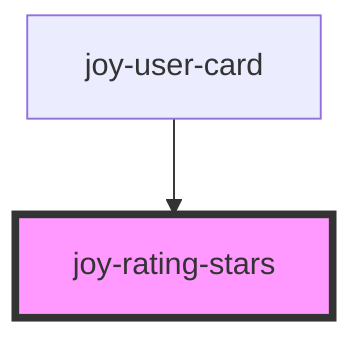

```ui_example
<joy-rating-stars rating-value="5"></joy-rating-stars>
```

## With review count

```ui_example
<joy-rating-stars rating-value="5" review-count="12"></joy-rating-stars>
```

## With specific wording
Use the ```slot="rating-stars-slot"``` attribute on any DOM Element

```ui_example
<joy-rating-stars rating-value="5">
    <span slot="rating-stars-slot">14 missions</span>
</joy-rating-stars>
```


<!-- Auto Generated Below -->


## Properties

| Property      | Attribute      | Description                                                       | Type                             | Default    |
| ------------- | -------------- | ----------------------------------------------------------------- | -------------------------------- | ---------- |
| `ratingValue` | `rating-value` | The actual rating, between 0 and 5.                               | `number`                         | `0`        |
| `reviewCount` | `review-count` | Review count. it will be displayed with parenthesis : (5)         | `number`                         | `0`        |
| `size`        | `size`         | Star size. 3 possible values but you can't give a number as value | `"large" \| "medium" \| "small"` | `'medium'` |


## Slots

| Slot                  | Description                                                                               |
| --------------------- | ----------------------------------------------------------------------------------------- |
| `"rating-stars-slot"` | Generic slot to add some additional content that requires translations, not only numbers. |


## Dependencies

### Used by

 - [joy-user-card](../user-card)

### Graph


----------------------------------------------

*Built with [StencilJS](https://stenciljs.com/)*
