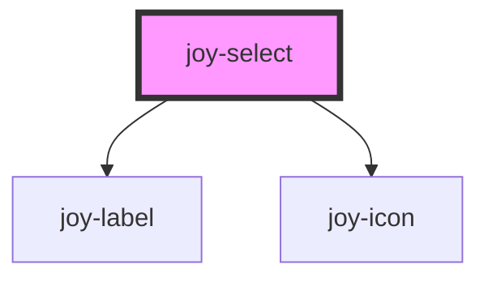

```ui_example
<joy-select name="my-select" label="I am the select label">
    <joy-option disabled selected>Choose your option...</joy-option>
    <joy-option value="first">First option</joy-option>
    <joy-option value="second">Second option</joy-option>
    <joy-option value="third">Third option</joy-option>
    <joy-option value="fourth">Fourth option</joy-option>
    <joy-option value="fifth">Fifth option</joy-option>
</joy-dropdown>
```

```ui_example
<joy-select name="my-select-2">
    <joy-label slot="select-label"><joy-icon name="chat"></joy-icon> If you need HTML in your label, use the slot</joy-label>
    
    <joy-option disabled selected>Choose your option...</joy-option>
    <joy-option value="first">First option</joy-option>
    <joy-option value="second">Second option</joy-option>
    <joy-option value="third">Third option</joy-option>
    <joy-option value="fourth">Fourth option</joy-option>
    <joy-option value="fifth">Fifth option</joy-option>
</joy-dropdown>
```


```ui_example
<joy-select name="my-select-3" disabled label="I am disabled">
    <joy-option disabled selected>Choose your option...</joy-option>
    <joy-option value="first">First option</joy-option>
    <joy-option value="second">Second option</joy-option>
    <joy-option value="third">Third option</joy-option>
    <joy-option value="fourth">Fourth option</joy-option>
    <joy-option value="fifth">Fifth option</joy-option>
</joy-dropdown>
```

```ui_example
<joy-select required name="my-select-4" invalid label="I am invalid">
    <joy-option disabled selected>Choose your option...</joy-option>
    <joy-option value="first">First option</joy-option>
    <joy-option value="second">Second option</joy-option>
    <joy-option value="third">Third option</joy-option>
    <joy-option value="fourth">Fourth option</joy-option>
    <joy-option value="fifth">Fifth option</joy-option>
</joy-dropdown>
```

<!-- Auto Generated Below -->


## Properties

| Property         | Attribute         | Description                                         | Type                  | Default               |
| ---------------- | ----------------- | --------------------------------------------------- | --------------------- | --------------------- |
| `disabled`       | `disabled`        | Disabled state. *                                   | `boolean`             | `false`               |
| `invalid`        | `invalid`         | Invalid state. *                                    | `boolean`             | `false`               |
| `invalidMessage` | `invalid-message` | Invalid state message. *                            | `string`              | `'Field is required'` |
| `label`          | `label`           | The label text.                                     | `string \| undefined` | `undefined`           |
| `labelSize`      | `label-size`      | The label input's size.                             | `"large" \| "medium"` | `'medium'`            |
| `name`           | `name`            | Select name attribute to be found by parent form. * | `string`              | `'dropdown'`          |
| `required`       | `required`        | Mandatory or not. *                                 | `boolean`             | `false`               |
| `requiredMark`   | `required-mark`   | Display the required mark or not. Default to true.  | `boolean`             | `true`                |
| `value`          | `value`           | Mandatory or not. *                                 | `string \| undefined` | `undefined`           |


## Events

| Event               | Description                                                                                            | Type                                                                           |
| ------------------- | ------------------------------------------------------------------------------------------------------ | ------------------------------------------------------------------------------ |
| `joy-select-change` | Custom event that returns the component instance and its actual value. Binded to select native event * | `CustomEvent<{ element: HTMLJoySelectElement; value?: string \| undefined; }>` |
| `value-change`      | Generic custom event name. Name is used by any form field *                                            | `CustomEvent<{ element: HTMLJoySelectElement; value?: string \| undefined; }>` |


## Dependencies

### Depends on

- [joy-label](../label)
- [joy-icon](../icon)

### Graph


----------------------------------------------

*Built with [StencilJS](https://stenciljs.com/)*
