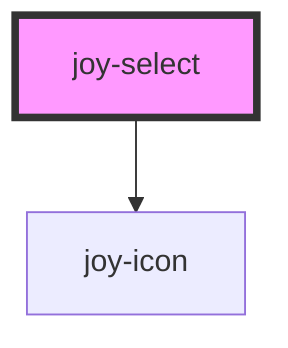

# joy-select

<!-- Auto Generated Below -->

## Properties

| Property   | Attribute  | Description | Type      | Default    |
| ---------- | ---------- | ----------- | --------- | ---------- |
| `disabled` | `disabled` |             | `boolean` | `false`    |
| `invalid`  | `invalid`  |             | `boolean` | `false`    |
| `name`     | `name`     |             | `string`  | `'select'` |
| `required` | `required` |             | `boolean` | `false`    |
| `value`    | `value`    |             | `string`  | `''`       |

## Dependencies

### Depends on

- [joy-icon](../icon)

### Graph

----------------------------------------------

*Built with [StencilJS](https://stenciljs.com/)*
