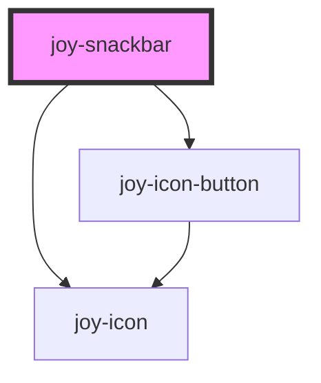

##Info 

<joy-snackbar level="info" position="relative" dangerous-html-message="I am an information message" duration="1000000"></joy-snackbar>

```ui_code_example
<joy-snackbar level="info" dangerous-html-message="I am an information message"></joy-snackbar>
```

## Success
<joy-snackbar duration="1000000" position="relative" level="success" dangerous-html-message="I am an success message"></joy-snackbar>

```ui_code_example
<joy-snackbar level="success" dangerous-html-message="I am an success message"></joy-snackbar>
```

## Warning
<joy-snackbar duration="1000000" position="relative" level="warning" dangerous-html-message="I am an warning message"></joy-snackbar>

```ui_code_example
<joy-snackbar level="warning" dangerous-html-message="I am an warning message"></joy-snackbar>
```

## Error
<joy-snackbar position="relative" duration="1000000" level="error" dangerous-html-message="I am an error message"></joy-snackbar>

```ui_code_example
<joy-snackbar level="error" dangerous-html-message="I am an error message"></joy-snackbar>
```

## Custom event link
<joy-snackbar position="relative" duration="1000000" level="success" dangerous-html-message="I am an success message" trigger-action-text="Cancel action"></joy-snackbar>

```ui_code_example
<joy-snackbar level="success" dangerous-html-message="I am an success message" trigger-action-text="Cancel action"></joy-snackbar>
```


<!-- Auto Generated Below -->


## Properties

| Property                            | Attribute                | Description                                                                                                                                             | Type                                                       | Default     |
| ----------------------------------- | ------------------------ | ------------------------------------------------------------------------------------------------------------------------------------------------------- | ---------------------------------------------------------- | ----------- |
| `closable`                          | `closable`               | Display an icon to close the notification manually                                                                                                      | `boolean \| undefined`                                     | `true`      |
| `dangerousHtmlMessage` _(required)_ | `dangerous-html-message` | HTML with your custom message injected in the component. It won't be escaped so please be careful with XSS !                                            | `string`                                                   | `undefined` |
| `duration`                          | `duration`               | Time in ms the snackbar is displayed. Give 'forever' to be able to display the snackbar without timeout                                                 | `"forever" \| number \| undefined`                         | `5000`      |
| `level`                             | `level`                  | The criticality level of your notification. Range from simple info to error.                                                                            | `"error" \| "info" \| "neutral" \| "success" \| "warning"` | `'success'` |
| `position`                          | `position`               | By default, the snackbar will be displayed in a fixed position at the bottom of the page. You can override this behavior by setting position="relative" | `"fixed" \| "relative" \| undefined`                       | `'fixed'`   |
| `triggerActionText`                 | `trigger-action-text`    | If you need to create an action link (like cancel an action from snackbar) simply pas its text. Clicking on it will trigger a custom event              | `string \| undefined`                                      | `undefined` |


## Events

| Event                         | Description                                                                                                                                                             | Type                |
| ----------------------------- | ----------------------------------------------------------------------------------------------------------------------------------------------------------------------- | ------------------- |
| `joy-snackbar-trigger-action` | use @joySnackbarTriggerAction="yourMethod" for Vue apps (onJoySnackbarTriggerAction for other stencil components) to handle snackbar custom action. Nothing is returned | `CustomEvent<void>` |


## Dependencies

### Depends on

- [joy-icon-button](../icon-button)
- [joy-icon](../icon)

### Graph


----------------------------------------------

*Built with [StencilJS](https://stenciljs.com/)*
