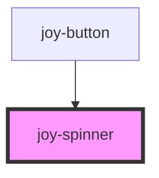

# joy-spinner

<!-- Auto Generated Below -->

## Properties

| Property | Attribute | Description                       | Type                  | Default     |
| -------- | --------- | --------------------------------- | --------------------- | ----------- |
| `color`  | `color`   | Spinner colors, 2 possible values | `string \| undefined` | `undefined` |

## Dependencies

### Used by

 - [joy-button](../button)

### Graph

----------------------------------------------

*Built with [StencilJS](https://stenciljs.com/)*
