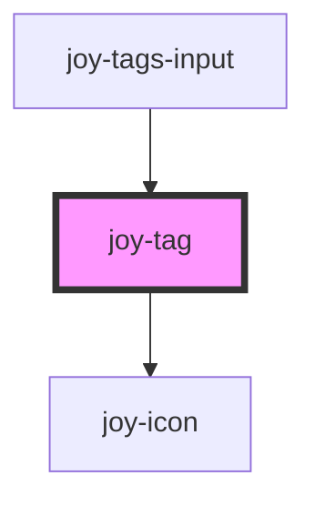

```ui_example
<joy-tag>Default tag</joy-tag>
```

## Variants
```ui_example
<joy-tags-list>
    <joy-tag variant="primary">Primary tag</joy-tag>
    <joy-tag variant="secondary">Secondary tag</joy-tag>
    <joy-tag variant="important">Important tag</joy-tag>
    <joy-tag variant="pending">Pending tag</joy-tag>
    <joy-tag variant="special">Special tag</joy-tag>
    <joy-tag variant="inactive">Inactive tag</joy-tag>
    <joy-tag variant="pricing">Pricing tag</joy-tag>
</joy-tags-list>
```

## Sizes
```ui_example
<joy-tags-list>
    <joy-tag size="xsmall">Xsmall tag</joy-tag>
    <joy-tag size="small">Small tag</joy-tag>
    <joy-tag size="medium">Medium tag</joy-tag>
    <joy-tag size="large">Large tag</joy-tag>
</joy-tags-list>
```

## Links
```ui_example
<joy-tags-list>
    <joy-tag href="https://malt.fr" target="_blank">Primary link</joy-tag>
    <joy-tag variant="secondary" href="https://malt.fr" target="_blank">Secondary link</joy-tag>
</joy-tags-list>
```

## Removable
```ui_example
<joy-tags-list>
    <joy-tag variant="primary" removable>Primary removable</joy-tag>
    <joy-tag variant="secondary" removable size="small">Secondary removable</joy-tag>
    <joy-tag variant="pricing" removable size="xsmall">Pricing removable</joy-tag>
</joy-tags-list>
```

## Draggable
```ui_example
<joy-tags-list>
    <joy-tag variant="primary" draggable>Primary draggable</joy-tag>
    <joy-tag variant="secondary" draggable>Secondary draggable</joy-tag>
    <joy-tag variant="pricing" draggable>Pricing draggable</joy-tag>
</joy-tag-list>
```

## Selectable
Only for primary and secondary variants.

```ui_example
<joy-tags-list>
    <joy-tag variant="primary" selectable>Click me</joy-tag>
    <joy-tag variant="secondary" selectable>Click me</joy-tag>
</joy-tag-list>
```

<!-- Auto Generated Below -->


## Properties

| Property     | Attribute    | Description                                                                                 | Type                                                                                           | Default     |
| ------------ | ------------ | ------------------------------------------------------------------------------------------- | ---------------------------------------------------------------------------------------------- | ----------- |
| `href`       | `href`       | If the tag is a link, give it an href                                                       | `string \| undefined`                                                                          | `undefined` |
| `removable`  | `removable`  | Display an icon CTA on the right, to remove the tag from a list. Only for primary/secondary | `boolean`                                                                                      | `false`     |
| `selectable` | `selectable` | Mock a radio like style. Nothing more. Only for primary/secondary                           | `boolean`                                                                                      | `false`     |
| `size`       | `size`       | Tag size. Default is medium                                                                 | `"large" \| "medium" \| "small" \| "xsmall"`                                                   | `'medium'`  |
| `target`     | `target`     | Native target attribute for hyperlinks.                                                     | `"_blank" \| "_parent" \| "_self" \| "_top" \| undefined`                                      | `undefined` |
| `variant`    | `variant`    | Tag color theme                                                                             | `"important" \| "inactive" \| "pending" \| "pricing" \| "primary" \| "secondary" \| "special"` | `'primary'` |


## Events

| Event            | Description                                | Type                                                |
| ---------------- | ------------------------------------------ | --------------------------------------------------- |
| `joy-tag-click`  | Fired only if we've set the clickable prop | `CustomEvent<{ name: string; selected: boolean; }>` |
| `joy-tag-remove` | Fired only if we've click on removable tag | `CustomEvent<string>`                               |


## Methods

### `selectTag(select?: boolean) => Promise<void>`

Select the tag from outside

#### Returns

Type: `Promise<void>`


## Dependencies

### Used by

 - [joy-tags-input](../tags-input)

### Depends on

- [joy-icon](../icon)

### Graph


----------------------------------------------

*Built with [StencilJS](https://stenciljs.com/)*
