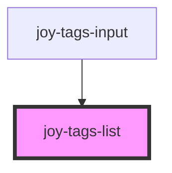

# joy-tags-list

<!-- Auto Generated Below -->

## Properties

| Property | Attribute | Description                      | Type                            | Default  |
| -------- | --------- | -------------------------------- | ------------------------------- | -------- |
| `align`  | `align`   | Tags justify-content strategy. * | `"center" \| "left" \| "right"` | `'left'` |

## Dependencies

### Used by

 - [joy-tags-input](../tags-input)

### Graph

----------------------------------------------

*Built with [StencilJS](https://stenciljs.com/)*
