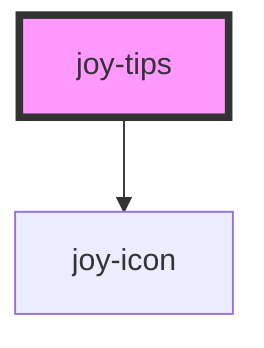

<joy-tag variant="important">WIP</joy-tag>

```ui_example
<joy-tips level="success" icon="mood-good">
    <span slot="tips-title">I am the tips title</span>
    <joy-text slot="tips-content">I am a paragraph with some very important content</joy-text>
    <joy-button slot="tips-cta" variant="primary" size="small">I am the CTA</joy-button>
</joy-text>
```

```ui_example
<joy-tips level="error" icon="mood-bad">
    <span slot="tips-title">I am the tips title</span>
    <joy-text slot="tips-content">I am a paragraph with some very important content</joy-text>
    <joy-button slot="tips-cta" variant="primary" size="small">I am the CTA</joy-button>
</joy-text>
```

```ui_example
<joy-tips level="warning" icon="info-circle">
    <span slot="tips-title">I am the tips title</span>
    <joy-text slot="tips-content">I am a paragraph with some very important content</joy-text>
    <joy-button slot="tips-cta" variant="primary" size="small">I am the CTA</joy-button>
</joy-text>
```

```ui_example
<joy-tips level="info" icon="info-circle">
    <span slot="tips-title">I am the tips title</span>
    <joy-text slot="tips-content">I am a paragraph with some very important content</joy-text>
    <joy-button slot="tips-cta" variant="primary" size="small">I am the CTA</joy-button>
</joy-text>
```

<!-- Auto Generated Below -->


## Properties

| Property   | Attribute  | Description                                              | Type                                          | Default     |
| ---------- | ---------- | -------------------------------------------------------- | --------------------------------------------- | ----------- |
| `closable` | `closable` | Display a CTA to hide the tips                           | `boolean`                                     | `false`     |
| `icon`     | `icon`     | If icon is defined, it will show it with the right color | `string \| undefined`                         | `undefined` |
| `level`    | `level`    | Defines the criticalness of the tips                     | `"error" \| "info" \| "success" \| "warning"` | `'info'`    |


## Dependencies

### Depends on

- [joy-icon](../icon)

### Graph


----------------------------------------------

*Built with [StencilJS](https://stenciljs.com/)*
