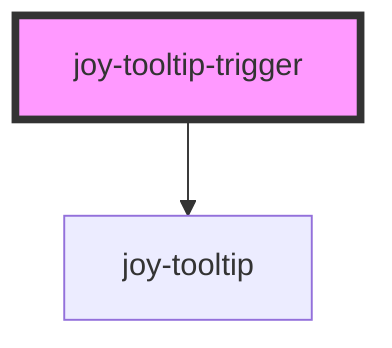

```ui_example
<joy-tooltip-trigger event="click" position="right">
    <p slot="tooltip-trigger">Click me to see Primary tooltip ! <joy-icon name="question-circle"></joy-icon></p>
    <p slot="tooltip-content">I am the content injected in the tooltip. I am right-aligned.</p> <strong slot="tooltip-content">Click outside to hide me.</strong>
</joy-tooltip-trigger>
```

```ui_example
<joy-tooltip-trigger event="mouseenter" variant="secondary">
    <joy-text slot="tooltip-trigger">Hover me to see Secondary tooltip ! <joy-icon name="question-circle"></joy-icon></joy-text>
    <p slot="tooltip-content">I am the content injected in the tooltip. I am left-aligned.</p>
</joy-tooltip-trigger>
```

<!-- Auto Generated Below -->


## Properties

| Property       | Attribute       | Description                                                                          | Type                       | Default        |
| -------------- | --------------- | ------------------------------------------------------------------------------------ | -------------------------- | -------------- |
| `appendTo`     | `append-to`     | Use basic selector to inject the tooltip in a specific DOM location. Default is body | `"body" \| "host"`         | `'body'`       |
| `event`        | `event`         | Define the event needed to display the tooltip                                       | `"click" \| "mouseenter"`  | `'mouseenter'` |
| `position`     | `position`      | Tooltip position. 2 possible values                                                  | `"left" \| "right"`        | `'left'`       |
| `tooltipWidth` | `tooltip-width` | Allows to override tooltip size. Allows to more easily calculate its position        | `number`                   | `250`          |
| `variant`      | `variant`       | Color theme. 2 possible values                                                       | `"primary" \| "secondary"` | `'primary'`    |


## Slots

| Slot                | Description                                                                                      |
| ------------------- | ------------------------------------------------------------------------------------------------ |
| `"tooltip-content"` | The content that will be cloned and injected in the actual tooltip. This slot content is hidden. |
| `"tooltip-trigger"` | The element you need to interact with, to display the tooltip                                    |


## Dependencies

### Depends on

- [joy-tooltip](../tooltip)

### Graph


----------------------------------------------

*Built with [StencilJS](https://stenciljs.com/)*
