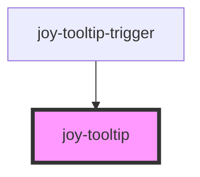

# joy-tooltip

<!-- Auto Generated Below -->

## Properties

| Property   | Attribute  | Description                         | Type                                     | Default     |
| ---------- | ---------- | ----------------------------------- | ---------------------------------------- | ----------- |
| `position` | `position` | Tooltip position. 2 possible values | `"bottom" \| "left" \| "right" \| "top"` | `'left'`    |
| `variant`  | `variant`  | Color theme. 2 possible values      | `"primary" \| "secondary"`               | `'primary'` |

## Slots

| Slot                | Description                                                                                      |
| ------------------- | ------------------------------------------------------------------------------------------------ |
| `"tooltip-content"` | The content that will be cloned and injected in the actual tooltip. This slot content is hidden. |

## Dependencies

### Used by

 - [joy-tooltip-trigger](../tooltip-trigger)

### Graph

----------------------------------------------

*Built with [StencilJS](https://stenciljs.com/)*
