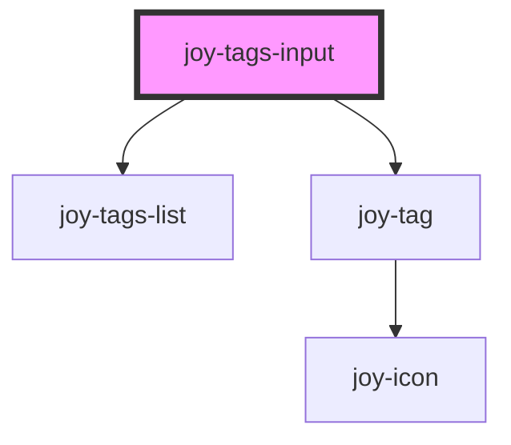

## Empty example

```ui_example
<joy-tags-input></joy-tags-input>
```

## With default values

```ui_example
<joy-tags-input validation="email" placeholder="Write and press enter to add" values="['test@valid-email.com']">
    <span slot="tags-input-label">Please enter emails lists</span>
</joy-tags-input>
```

## Invalid example 
<joy-highlight level="warning" display-icon>
    To deal with form error display, you need to use tags-input 'joyTagsError" custom event.
    Listen to this event and show/hide the form error with the specific translation you need, according to the type of error returned by the event detail.
</joy-highlight>

```ui_example
<joy-tags-input validation="email" placeholder="Write and press enter to add" values="['test@valid-email.com', 'test@not-valid-email']">
    <span slot="tags-input-label">Please enter emails lists</span>
</joy-tags-input>

<joy-form-error no-html-error-text="One of given emails is not valid."></joy-form-error>
```

<!-- Auto Generated Below -->


## Properties

| Property      | Attribute     | Description                                                                                                             | Type                                                                                           | Default                 |
| ------------- | ------------- | ----------------------------------------------------------------------------------------------------------------------- | ---------------------------------------------------------------------------------------------- | ----------------------- |
| `invalid`     | `invalid`     | Invalid state                                                                                                           | `boolean`                                                                                      | `false`                 |
| `name`        | `name`        | form name for our tags input                                                                                            | `string / undefined`                                                                          | `undefined`             |
| `placeholder` | `placeholder` | Placeholder used for the input                                                                                          | `string`                                                                                       | `'Add your items here'` |
| `size`        | `size`        | Size for your tags. Check Tag documentation for available values                                                        | `"large" / "medium" / "small" / "xsmall"`                                                   | `'small'`               |
| `validation`  | `validation`  | Validation type : if 'email' is given, it will create a specific check before actually adding the tag. Default to none. | `"email" / "none"`                                                                            | `'none'`                |
| `values`      | `values`      | Saved values for the tags list. Must be an array like string eg. ['first', 'second'].                                   | `string / undefined`                                                                          | `undefined`             |
| `variant`     | `variant`     | Variant/color type for your tags. Check Tag documentation for available values                                          | `"important" / "inactive" / "pending" / "pricing" / "primary" / "secondary" / "special"` | `'primary'`             |


## Events

| Event               | Description                                                                                           | Type                                  |
| ------------------- | ----------------------------------------------------------------------------------------------------- | ------------------------------------- |
| `joyTagsError`      | When the tags list is on error. According to the returned ErrorType, you can display the right error. | `CustomEvent<"duplicate" / "email">` |
| `joyTagsInputBlur`  | On input blur                                                                                         | `CustomEvent<void>`                   |
| `joyTagsInputFocus` | On input focus                                                                                        | `CustomEvent<void>`                   |
| `joyTagsUpdate`     | When the tags list is updated                                                                         | `CustomEvent<string[]>`               |


## Methods

### `getValues() => Promise<string[]>`

Get the array of values contained in the tag input

#### Returns

Type: `Promise<string[]>`


## Dependencies

### Depends on

- [joy-tags-list](../tags-list)
- [joy-tag](../tag)

### Graph


----------------------------------------------

*Built with [StencilJS](https://stenciljs.com/)*
