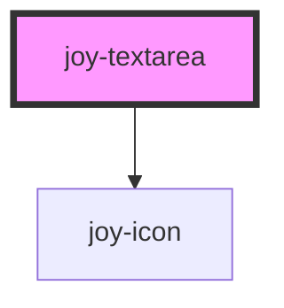

### Default

```ui_example
<joy-textarea placeholder="Hello, you can write anything here..."></joy-textarea>
```

### More advanced example

```ui_example
<joy-textarea auto-grow minlength="100" maxlength="300" placeholder="Textarea with auto-grow and validation helpers activated.">
    <span slot="textarea-label">Textarea label</span>
</joy-textarea>
```

### Disabled

```ui_example
<joy-textarea disabled minlength="100" maxlength="300" placeholder="Hello, you can write anything here...">
    <span slot="textarea-label">Textarea label</span>
</joy-textarea>
```

### Error

```ui_example
<joy-textarea invalid minlength="100" maxlength="300" placeholder="Hello, you can write anything here...">
    <span slot="textarea-label">Textarea label</span>
</joy-textarea>
```


<!-- Auto Generated Below -->


## Properties

| Property         | Attribute         | Description                                                                                                                                                                      | Type                                                                                               | Default        |
| ---------------- | ----------------- | -------------------------------------------------------------------------------------------------------------------------------------------------------------------------------- | -------------------------------------------------------------------------------------------------- | -------------- |
| `autoGrow`       | `auto-grow`       | If `true`, the element height will increase based on the value.                                                                                                                  | `boolean`                                                                                          | `false`        |
| `autocapitalize` | `autocapitalize`  | Indicates whether and how the text value should be automatically capitalized as it is entered/edited by the user.                                                                | `string`                                                                                           | `'none'`       |
| `autofocus`      | `autofocus`       | This Boolean attribute lets you specify that a form control should have input focus when the page loads.                                                                         | `boolean`                                                                                          | `false`        |
| `clearOnEdit`    | `clear-on-edit`   | If `true`, the value will be cleared after focus upon edit. Defaults to `true` when `type` is `"password"`, `false` for all other types.                                         | `boolean`                                                                                          | `false`        |
| `cols`           | `cols`            | The visible width of the text control, in average character widths. If it is specified, it must be a positive integer.                                                           | `number \| undefined`                                                                              | `undefined`    |
| `debounce`       | `debounce`        | Set the amount of time, in milliseconds, to wait to trigger the `ionChange` event after each keystroke. This also impacts form bindings such as `ngModel` or `v-model`.          | `number`                                                                                           | `0`            |
| `disabled`       | `disabled`        | If `true`, the user cannot interact with the textarea.                                                                                                                           | `boolean`                                                                                          | `false`        |
| `enterkeyhint`   | `enterkeyhint`    | A hint to the browser for which enter key to display. Possible values: `"enter"`, `"done"`, `"go"`, `"next"`, `"previous"`, `"search"`, and `"send"`.                            | `"done" \| "enter" \| "go" \| "next" \| "previous" \| "search" \| "send" \| undefined`             | `undefined`    |
| `inputmode`      | `inputmode`       | A hint to the browser for which keyboard to display. Possible values: `"none"`, `"text"`, `"tel"`, `"url"`, `"email"`, `"numeric"`, `"decimal"`, and `"search"`.                 | `"decimal" \| "email" \| "none" \| "numeric" \| "search" \| "tel" \| "text" \| "url" \| undefined` | `undefined`    |
| `invalid`        | `invalid`         | If `true`, the textarea will be considered as invalid.                                                                                                                           | `boolean`                                                                                          | `false`        |
| `maxlength`      | `maxlength`       | If the value of the type attribute is `text`, `email`, `search`, `password`, `tel`, or `url`, this attribute specifies the maximum number of characters that the user can enter. | `number \| undefined`                                                                              | `undefined`    |
| `minlength`      | `minlength`       | If the value of the type attribute is `text`, `email`, `search`, `password`, `tel`, or `url`, this attribute specifies the minimum number of characters that the user can enter. | `number \| undefined`                                                                              | `undefined`    |
| `minlengthLabel` | `minlength-label` | Use this prop to give component the translation used to display minimum chars count.                                                                                             | `string \| undefined`                                                                              | `undefined`    |
| `name`           | `name`            | The name of the control, which is submitted with the form data.                                                                                                                  | `string`                                                                                           | `this.inputId` |
| `placeholder`    | `placeholder`     | Instructional text that shows before the input has a value.                                                                                                                      | `null \| string \| undefined`                                                                      | `undefined`    |
| `readonly`       | `readonly`        | If `true`, the user cannot modify the value.                                                                                                                                     | `boolean`                                                                                          | `false`        |
| `required`       | `required`        | If `true`, the user must fill in a value before submitting a form.                                                                                                               | `boolean`                                                                                          | `false`        |
| `rows`           | `rows`            | The number of visible text lines for the control.                                                                                                                                | `number \| undefined`                                                                              | `4`            |
| `spellcheck`     | `spellcheck`      | If `true`, the element will have its spelling and grammar checked.                                                                                                               | `boolean`                                                                                          | `false`        |
| `value`          | `value`           | The value of the textarea.                                                                                                                                                       | `null \| string \| undefined`                                                                      | `''`           |
| `wrap`           | `wrap`            | Indicates how the control wraps text.                                                                                                                                            | `"hard" \| "off" \| "soft" \| undefined`                                                           | `undefined`    |


## Events

| Event               | Description                               | Type                              |
| ------------------- | ----------------------------------------- | --------------------------------- |
| `joyTextareaBlur`   | Emitted when the input loses focus.       | `CustomEvent<FocusEvent>`         |
| `joyTextareaChange` | Emitted when the input value has changed. | `CustomEvent<{ value: string; }>` |
| `joyTextareaFocus`  | Emitted when the input has focus.         | `CustomEvent<FocusEvent>`         |
| `joyTextareaInput`  | Emitted when a keyboard input occurred.   | `CustomEvent<KeyboardEvent>`      |


## Methods

### `getInputElement() => Promise<HTMLTextAreaElement>`

Returns the textarea nested in the component shadowDOM

#### Returns

Type: `Promise<HTMLTextAreaElement>`

- Returns the native `<textarea>` element used under the hood.

### `setFocus() => Promise<void>`

Sets focus on the native `textarea` in `ion-textarea`. Use this method instead of the global
`textarea.focus()`.

#### Returns

Type: `Promise<void>`


## Dependencies

### Depends on

- [joy-icon](../icon)

### Graph


----------------------------------------------

*Built with [StencilJS](https://stenciljs.com/)*
